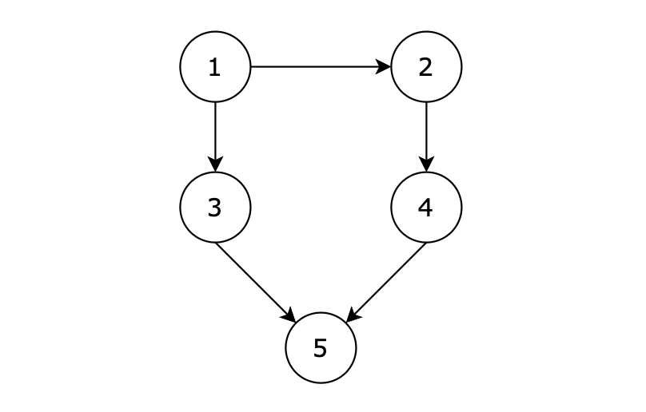

### 01、所有可达路径（20240624，98题，卡玛网）
给定一个有 n 个节点的有向无环图，节点编号从 1 到 n。请编写一个函数，找出并返回所有从节点 1 到节点 n 的路径。每条路径应以节点编号的列表形式表示。

【输入描述】

- 第一行包含两个整数 N，M，表示图中拥有 N 个节点，M 条边

- 后续 M 行，每行包含两个整数 s 和 t，表示图中的 s 节点与 t 节点中有一条路径

【输出描述】

- 输出所有的可达路径，路径中所有节点的后面跟一个空格，每条路径独占一行，存在多条路径，路径输出的顺序可任意。

- 如果不存在任何一条路径，则输出 -1。

- 注意输出的序列中，最后一个节点后面没有空格！ 例如正确的答案是 1 3 5,而不是 1 3 5， 5后面没有空格！  
  
【输入示例】
>5 5  
1 3  
3 5  
1 2  
2 4  
4 5  

【输出示例】
>1 3 5  
1 2 4 5  
  
【提示信息】  


【用例解释】

有五个节点，其中的从 1 到达 5 的路径有两个，分别是 1 -> 3 -> 5 和 1 -> 2 -> 4 -> 5。

因为拥有多条路径，所以输出结果为：

>1 3 5   
1 2 4 5

或

>1 2 4 5  
1 3 5  

都算正确。

数据范围：

图中不存在自环
图中不存在平行边  
1 <= N <= 100  
1 <= M <= 500  

>自己答案（去注释，通过！）
```C++
/*
思路：
使用邻接矩阵构造图；
横坐标是当前遍历的节点A，纵坐标是A可能得下一个节点B；
找到B后，递归节点B，找到可能的下一个节点C
*/
#include <iostream>
#include <vector>

using namespace std;  // 不写这句，vector会报错！！！或者代码中都使用std::vector

vector<int> path;
vector<vector<int>> result;
int dest_num = 0;

void backTracking(vector<vector<int>>& arr, int cur_node){
    if(cur_node == dest_num){  // 到达目的数，存储结果
        result.push_back(path);
        return;
    }
    // 必须有个判断是否重复走过路径，也直接返回。可以将使用过的数据在回溯函数中进行传递
    // if(cur_node == dest_num){  // 到达目的数，存储结果
    //     result.push_back(path);
    //     return;
    // }
    
    for(int i = 1; i <= dest_num; i++){ // 查找当前节点的下一个节点
        if(arr[cur_node][i] == 1){  // 说明cur_node节点可以走到i节点
            
            path.push_back(i);
            backTracking(arr, i);
            path.pop_back();  // path.pop(); vector的删除元素是pop_back()
        }
    }
    return;
}


int main(){
    int node_count = 0;
    int side_count = 0;
    int count = 0;
    
    while(cin >> node_count >> side_count){
            // cin >> node_count >> side_count;
        dest_num = node_count;
        count = side_count;
        
        int node1, node2;
        vector<vector<int>> array(node_count+1,vector<int>(node_count+1, 0));
        while(cin >> node1 >> node2){
            count--;
            array[node1][node2] = 1;
            if(count == 0){
                break;
            }
        }
        
        path.clear();
        result.clear();
        path.push_back(1);
        backTracking(array, 1);  // 从节点1开始
        
        if(result.size() == 0){
            cout << -1 << endl;
            continue;
        }
        for(auto vec : result){
            for(auto i = 0; i < vec.size(); i++){  // for(int i = 0; i < vec.size(); i++) vec.size()返回的是一个无符号整数，而你的循环变量i是一个有符号整数。这种比较可能会引起潜在的问题!!!
                if(i != vec.size()-1){
                    cout << vec[i] << " ";
                }else{
                    cout << vec[i] << endl;
                }
            }
        }

    }
}
```

>自己答案（通过！）
```C++
/*
思路：
使用邻接矩阵构造图；
横坐标是当前遍历的节点A，纵坐标是A可能得下一个节点B；
找到B后，递归节点B，找到可能的下一个节点C
*/
#include <iostream>
#include <vector>

using namespace std;  // 不写这句，vector会报错！！！或者代码中都使用std::vector

vector<int> path;
vector<vector<int>> result;
int dest_num = 0;

void backTracking(vector<vector<int>>& arr, int cur_node){
    if(cur_node == dest_num){  // 到达目的数，存储结果
        result.push_back(path);
        return;
    }
    // 必须有个判断是否重复走过路径，也直接返回。可以将使用过的数据在回溯函数中进行传递
    // if(cur_node == dest_num){  // 到达目的数，存储结果
    //     result.push_back(path);
    //     return;
    // }
    
    for(int i = 1; i <= dest_num; i++){ // 查找当前节点的下一个节点
        if(arr[cur_node][i] == 1){  // 说明cur_node节点可以走到i节点
            
            path.push_back(i);
            backTracking(arr, i);
            path.pop_back();  // path.pop(); vector的删除元素是pop_back()
        }
    }
    return;
}


int main(){
    int node_count = 0;
    int side_count = 0;
    int count = 0;
    
    while(cin >> node_count >> side_count){
            // cin >> node_count >> side_count;
        dest_num = node_count;
        count = side_count;
        
        int node1, node2;
        vector<vector<int>> array(node_count+1,vector<int>(node_count+1, 0));
        while(cin >> node1 >> node2){
            count--;
            array[node1][node2] = 1;
            if(count == 0){
                break;
            }
        }
        
        path.clear();
        result.clear();
        path.push_back(1);
        backTracking(array, 1);  // 从节点1开始
        
        if(result.size() == 0){
            cout << -1 << endl;
            continue;
        }
        for(auto vec : result){
            for(auto i = 0; i < vec.size(); i++){  // for(int i = 0; i < vec.size(); i++) vec.size()返回的是一个无符号整数，而你的循环变量i是一个有符号整数。这种比较可能会引起潜在的问题!!!
                if(i != vec.size()-1){
                    cout << vec[i] << " ";
                }else{
                    cout << vec[i] << endl;
                }
            }
        }

    }
}
```

