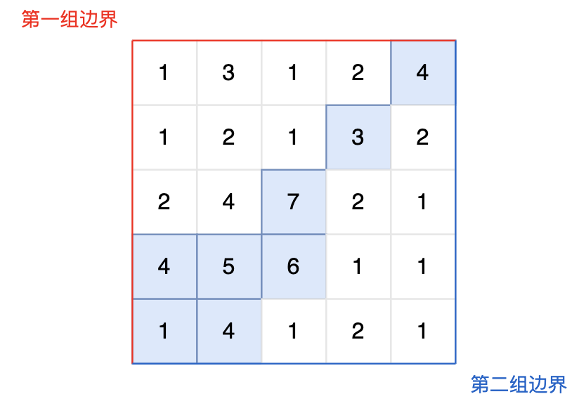

### 03、水流问题（20240626，103题，卡玛网）
题目描述：

- 现有一个 N × M 的矩阵，每个单元格包含一个数值，这个数值代表该位置的相对高度。矩阵的左边界和上边界被认为是第一组边界，而矩阵的右边界和下边界被视为第二组边界。

- 矩阵模拟了一个地形，当雨水落在上面时，水会根据地形的倾斜向低处流动，但只能从较高或等高的地点流向较低或等高并且相邻（上下左右方向）的地点。我们的目标是确定那些单元格，从这些单元格出发的水可以达到第一组边界和第二组边界。

输入描述：

- 第一行包含两个整数 N 和 M，分别表示矩阵的行数和列数。

- 后续 N 行，每行包含 M 个整数，表示矩阵中的每个单元格的高度。

输出描述：

- 输出共有多行，每行输出两个整数，用一个空格隔开，表示可达第一组边界和第二组边界的单元格的坐标，输出顺序任意。

输入示例：

>5 5  
1 3 1 2 4  
1 2 1 3 2  
2 4 7 2 1  
4 5 6 1 1  
1 4 1 2 1  

输出示例：

>0 4  
1 3  
2 2  
3 0  
3 1  
3 2  
4 0  
4 1  

提示信息：


- 图中的蓝色方块上的雨水既能流向第一组边界，也能流向第二组边界。所以最终答案为所有蓝色方块的坐标。

数据范围：

- 1 <= M, N <= 50

<h3>自己调试后答案（深度优先搜索法，通过！）</h3>

```C++
#include <iostream>
#include <vector>
#include <unordered_set>
#include <set>

using namespace std;

int dir[4][2] = {0,1, 1,0, 0,-1, -1,0};

set<pair<int, int>> result;
bool first_side = false;
bool second_side = false;
    
void dfs(const vector<vector<int>>& map, vector<vector<int>>& visited, int x, int y){
    int row_size = static_cast<int>(map.size());  
    int col_size = static_cast<int>(map[0].size());  

    visited[x][y] = true;
    
    if(x == 0 && (y >= 0 && y <= col_size-1) ){ // 到达第一组的上边界  
        first_side = true;
    }
    
    if(x == row_size-1 && (y < col_size && y >= 0) ){ // 到达第二组的下边界，
        second_side = true;
    }
    
    if((x >= 0 && x <= row_size-1) && y == 0 ){ // 到达左边界
        first_side = true;
    }
    
    if((x >= 0 && x <= row_size-1) && y == col_size-1 ){ // 到达右边界
        second_side = true;
    }
    
    for(int i = 0; i < 4; i++){
        int newx = x + dir[i][0];
        int newy = y + dir[i][1];
        
        if(newx < 0 || newx >= row_size || newy < 0 || newy >= col_size || visited[newx][newy] || map[x][y] < map[newx][newy]){
            continue;
        }
        
        dfs(map, visited, newx, newy);
    }
}

void search(const vector<vector<int>>& map){
    int row_size = static_cast<int>(map.size());
    int col_size = static_cast<int>(map[0].size());
    for(int x = 0; x < row_size; x++){
        for(int y = 0; y < col_size; y++){
            vector<vector<int>> visited(row_size, vector<int>(col_size,false)); // 考察新的点，需要重新标记visited
            visited[x][y] = true;
            dfs(map, visited, x, y);
            if(first_side && second_side){
                result.insert({x, y});  // result.push({x, y}); set是没有push方法的！！！
            }   
            first_side = false;
            second_side = false;
        }
    }
}

int main(){
    int row;
    int col;
    
    cin >> row >> col;
    
    vector<vector<int>> map(row, vector<int>(col, 0));   // vector<vector<int>> map(row, vector<col, 0>); 二维vector初始化，内层<>和()搞错了
    for(int i = 0; i < row; i++){
        for(int j = 0; j < col; j++){
            cin >> map[i][j];
        }
    }
    
    search(map);
    
    for(auto pair : result){
        cout << pair.first << " " << pair.second << endl;
    }
}
```


<h3>卡玛网（深度优先搜索法）</h3>

```C++
#include <iostream>
#include <vector>
using namespace std;
int n, m;
int dir[4][2] = {-1, 0, 0, -1, 1, 0, 0, 1};

// 从 x，y 出发 把可以走的地方都标记上
void dfs(vector<vector<int>>& grid, vector<vector<bool>>& visited, int x, int y) {
    if (visited[x][y]) return;

    visited[x][y] = true;

    for (int i = 0; i < 4; i++) {
        int nextx = x + dir[i][0];
        int nexty = y + dir[i][1];
        if (nextx < 0 || nextx >= n || nexty < 0 || nexty >= m) continue;
        if (grid[x][y] < grid[nextx][nexty]) continue; // 高度不合适

        dfs (grid, visited, nextx, nexty);
    }
    return;
}
bool isResult(vector<vector<int>>& grid, int x, int y) {
    vector<vector<bool>> visited(n, vector<bool>(m, false));

    // 深搜，将x,y出发 能到的节点都标记上。
    dfs(grid, visited, x, y);
    bool isFirst = false;
    bool isSecond = false;

    // 以下就是判断x，y出发，是否到达第一组边界和第二组边界
    // 第一边界的上边
    for (int j = 0; j < m; j++) {
        if (visited[0][j]) {
            isFirst = true;
            break;
        }
    }
    // 第一边界的左边
    for (int i = 0; i < n; i++) {
        if (visited[i][0]) {
            isFirst = true;
            break;
        }
    }
    // 第二边界右边
    for (int j = 0; j < m; j++) {
        if (visited[n - 1][j]) {
            isSecond = true;
            break;
        }
    }
    // 第二边界下边
    for (int i = 0; i < n; i++) {
        if (visited[i][m - 1]) {
            isSecond = true;
            break;
        }
    }
    if (isFirst && isSecond) return true;
    return false;
}


int main() {
    cin >> n >> m;
    vector<vector<int>> grid(n, vector<int>(m, 0));
    for (int i = 0; i < n; i++) {
        for (int j = 0; j < m; j++) {
            cin >> grid[i][j];
        }
    }
    // 遍历每一个点，看是否能同时到达第一组边界和第二组边界
    for (int i = 0; i < n; i++) {
        for (int j = 0; j < m; j++) {
            if (isResult(grid, i, j)) {
                cout << i << " " << j << endl;
            }
        }
    }
}

```

<h3>仿写ChatGPT答案</h3>

```C++
/*
广度搜索似乎不好做，改为深度优先搜索
*/

#include <iostream>
#include <vector>
#include <unordered_set>
#include <set>

using namespace std;

int dir[4][2] = {0,1, 1,0, 0,-1, -1,0};

void dfs(const vector<vector<int>>& map, vector<vector<bool>>& visited, int x, int y){
    int row_size = static_cast<int>(map.size());  // row_size = static_cast<int>(map.size()); 临时变量赋值忘记写它的数据类型！！！
    int col_size = static_cast<int>(map[0].size());  // col_size = static_cast<int>(map[0].size()); 临时变量赋值忘记写它的数据类型！！！
    
    visited[x][y] = true;
    for(int i = 0; i < 4; i++){
        int newx = x + dir[i][0];
        int newy = y + dir[i][1];
        
        if(newx < 0 || newx >= row_size || newy < 0 || newy >= col_size || visited[newx][newy] || map[x][y] > map[newx][newy]){
            continue;
        }
        
        dfs(map, visited, newx, newy);
    }
}

vector<pair<int, int>> search(const vector<vector<int>>& map){
    int row_size = map.size();
    int col_size = map[0].size();
    vector<vector<bool>> can_reach_first_board(row_size, vector<bool>(col_size, false));
    vector<vector<bool>> can_reach_second_board(row_size, vector<bool>(col_size, false));
    
    for(int x = 0; x < row_size; x++){  
        dfs(map, can_reach_first_board, x, 0);          // 第一边界左边, x=[0:row_size-1], y=0.
        dfs(map, can_reach_second_board, x, col_size-1); // 第二边界右边, x=[0:row_size-1], y=col_size-1
    }
    
    for(int y = 0; y < col_size; y++){  
        dfs(map, can_reach_first_board, 0, y);          // 第一边界上边, x=0, y=[0:col_size-1].
        dfs(map, can_reach_second_board, row_size-1, y); // 第二边界下边, x=row_size-1, y=[0:col_size-1]
    }
    
    vector<pair<int, int>> result;
    for(int i = 0; i < row_size; i++){
        for(int j = 0; j < col_size; j++){
            if(can_reach_first_board[i][j] == true && can_reach_second_board[i][j] == true){
                result.push_back({i,j});
            }
        }
    }

    return result;
}

int main(){
    int row;
    int col;
    
    cin >> row >> col;
    
    vector<vector<int>> map(row, vector<int>(col, 0));   
    for(int i = 0; i < row; i++){
        for(int j = 0; j < col; j++){
            cin >> map[i][j];
        }
    }
    
    vector<pair<int, int>> result = search(map);
    for(auto pair : result){
        cout << pair.first << " " << pair.second << endl;
    }
}
```

<h3>复杂度分析</h3>

1. **时间复杂度**:
   - 每个单元格可能会被DFS访问一次。
   - 总共有 $O(N \times M)$ 个单元格，每次DFS在4个方向上进行递归检查。
   - 因此，时间复杂度为 $(O(N \times M))$。

2. **空间复杂度**:
   - 需要两个额外的二维布尔矩阵 `canReachFirstGroup` 和 `canReachSecondGroup`，每个矩阵大小为 $(N \times M)$。
   - 递归深度为 $(O(N \times M))$。
   - 因此，空间复杂度为 $(O(N \times M))$。

整体来说，算法的时间和空间复杂度均为 $(O(N \times M))$，这是因为我们需要遍历所有的单元格并存储中间结果。


<h3>ChatGPT答案</h3>

```C++
/*
要找到能够从高处流到两组边界A和B的所有点；
反过来也就是从两组边界A和B的各点出发，所能够达到的这些点中，两组边界都能达到的点就是所求的高点。

从一点出发，寻找规则下（新点比当前点的数值大或小）所有点是简单，这样转化后更好求解了！！！
*/
#include <iostream>
#include <vector>
using namespace std;

void dfs(vector<vector<int>>& matrix, vector<vector<bool>>& visited, int x, int y) {
    int rows = matrix.size();
    int cols = matrix[0].size();
    visited[x][y] = true;

    int directions[4][2] = {{-1, 0}, {1, 0}, {0, -1}, {0, 1}};
    for (auto& dir : directions) {
        int newX = x + dir[0];
        int newY = y + dir[1];
        if (newX >= 0 && newX < rows && newY >= 0 && newY < cols && !visited[newX][newY] && matrix[newX][newY] >= matrix[x][y]) {
            dfs(matrix, visited, newX, newY);
        }
    }
}

vector<pair<int, int>> findWaterFlowCells(vector<vector<int>>& matrix) {
    int rows = matrix.size();
    int cols = matrix[0].size();
    vector<vector<bool>> canReachFirstGroup(rows, vector<bool>(cols, false));
    vector<vector<bool>> canReachSecondGroup(rows, vector<bool>(cols, false));

    for (int i = 0; i < rows; ++i) {
        dfs(matrix, canReachFirstGroup, i, 0); // Left boundary
        dfs(matrix, canReachSecondGroup, i, cols - 1); // Right boundary
    }
    for (int j = 0; j < cols; ++j) {
        dfs(matrix, canReachFirstGroup, 0, j); // Top boundary
        dfs(matrix, canReachSecondGroup, rows - 1, j); // Bottom boundary
    }

    vector<pair<int, int>> result;
    for (int i = 0; i < rows; ++i) {
        for (int j = 0; j < cols; ++j) {
            if (canReachFirstGroup[i][j] && canReachSecondGroup[i][j]) {
                result.emplace_back(i, j);
            }
        }
    }
    return result;
}

int main() {
    int N, M;
    cin >> N >> M;
    vector<vector<int>> matrix(N, vector<int>(M));
    for (int i = 0; i < N; ++i) {
        for (int j = 0; j < M; ++j) {
            cin >> matrix[i][j];
        }
    }

    vector<pair<int, int>> result = findWaterFlowCells(matrix);
    for (auto& cell : result) {
        cout << cell.first << " " << cell.second << endl;
    }
    return 0;
}
```

<h3>自己答案v2（去注释，深度优先搜索,未通过）</h3>

```C++
#include <iostream>
#include <vector>
#include <set>

using namespace std;

int dir[4][2] = {0,1, 1,0, 0,-1, -1,0};
set<pair<int, int>> result;
bool first_side = false;
bool second_side = false;
    
void dfs(const vector<vector<int>>& map, vector<vector<int>>& visited, int x, int y){
    int row_size = static_cast<int>(map.size());  
    int col_size = static_cast<int>(map[0].size());  

    if(x == 0 && x == col_size-1 ){ // 到达右上角两边界
        first_side = true;
        second_side = true;
    }else if(x == 0 && (y < col_size && y >= 0) ){ // 就算只有一行，也会优先走上面的两边界情况
        first_side = true;
    }  
    
    if(x == row_size-1 && y == 0 ){ // 到达左下角两边界
        first_side = true;
        second_side = true;
    }else if(x == row_size-1 && (y < col_size && y > 0) ){ // 就算只有一行，也会优先走上面的两边界情况
        second_side = true;
    }
    
    if((x > 0 && x < row_size-1) && y == 0 ){ // 到达左边界
        first_side = true;
    }
    if((x > 0 && x < row_size-1) && y == col_size-1 ){ // 到达右边界，1列的时候可以和上个判断组合
        second_side = true;
    }
    
    for(int i = 0; i < 4; i++){
        int newx = x + dir[i][0];
        int newy = y + dir[i][1];
        
        if(newx < 0 || newx >= row_size || newy < 0 || newy >= col_size || visited[newx][newy] || map[x][y] < map[newx][newy]){
            continue;
        }
        
        visited[newx][newy] = true;
        dfs(map, visited, newx, newy);
        visited[newx][newy] = false;
    }
}

void search(const vector<vector<int>>& map){
    int row_size = static_cast<int>(map.size());
    int col_size = static_cast<int>(map[0].size());
    for(int x = 0; x < row_size; x++){
        for(int y = 0; y < col_size; y++){
            vector<vector<int>> visited(row_size, vector<int>(col_size,false)); 
            visited[x][y] = true;
            dfs(map, visited, x, y);
            if(first_side && second_side){
                result.insert({x, y});  
            }   
            first_side = false;
            second_side = false;
        }
    }
}

int main(){
    int row;
    int col;
    
    cin >> row >> col;
    
    vector<vector<int>> map(row, vector<int>(col, 0));  
    for(int i = 0; i < row; i++){
        for(int j = 0; j < col; j++){
            cin >> map[i][j];
        }
    }
    
    search(map);
    
    for(auto pair : result){
        cout << pair.first << " " << pair.second << endl;
    }
}
```

<h3>自己答案v2（深度优先搜索,未通过）</h3>

```C++
/*
广度搜索似乎不好做，改为深度优先搜索
*/
#include <iostream>
#include <vector>
#include <unordered_set>
#include <set>

using namespace std;

int dir[4][2] = {0,1, 1,0, 0,-1, -1,0};
// vector<pair<int, int>> result;
// unordered_set<pair<int, int>> result;
set<pair<int, int>> result;
bool first_side = false;
bool second_side = false;
    
// 递归中，可能在某一条路径到达第一边界，在另一条路径到达第二边界；所以需要将first_side和second_side设置为全局的，只要当前点的所有遍历过程将二者置为真即可！！！
void dfs(const vector<vector<int>>& map, vector<vector<int>>& visited, int x, int y){
    int row_size = static_cast<int>(map.size());  // row_size = static_cast<int>(map.size()); 临时变量赋值忘记写它的数据类型！！！
    int col_size = static_cast<int>(map[0].size());  // col_size = static_cast<int>(map[0].size()); 临时变量赋值忘记写它的数据类型！！！
    // bool first_side = false;
    // bool second_side = false;

    if(x == 0 && x == col_size-1 ){ // 到达右上角两边界
        first_side = true;
        second_side = true;
    }else if(x == 0 && (y < col_size && y >= 0) ){ // 就算只有一行，也会优先走上面的两边界情况
        first_side = true;
    }  
    
    if(x == row_size-1 && y == 0 ){ // 到达左下角两边界
        first_side = true;
        second_side = true;
    }else if(x == row_size-1 && (y < col_size && y > 0) ){ // 就算只有一行，也会优先走上面的两边界情况
        second_side = true;
    }
    
    if((x > 0 && x < row_size-1) && y == 0 ){ // 到达左边界
        first_side = true;
    }
    if((x > 0 && x < row_size-1) && y == col_size-1 ){ // 到达右边界，1列的时候可以和上个判断组合
        second_side = true;
    }
    
    // if(first_side && second_side){
    //     return true;
    //     result.push_back({x, y});
    // }   
    
    // if(first_side && second_side){
    //     result.insert({x, y});// result.push({x, y}); set是没有push方法的！！！
    // }   
    
    for(int i = 0; i < 4; i++){
        int newx = x + dir[i][0];
        int newy = y + dir[i][1];
        
        if(newx < 0 || newx >= row_size || newy < 0 || newy >= col_size || visited[newx][newy] || map[x][y] < map[newx][newy]){
            continue;
        }
        
        visited[newx][newy] = true;
        dfs(map, visited, newx, newy);
        visited[newx][newy] = false;
    }
}

void search(const vector<vector<int>>& map){
    int row_size = static_cast<int>(map.size());
    int col_size = static_cast<int>(map[0].size());
    for(int x = 0; x < row_size; x++){
        for(int y = 0; y < col_size; y++){
            vector<vector<int>> visited(row_size, vector<int>(col_size,false)); // 考察新的点，需要重新标记visited
            visited[x][y] = true;
            dfs(map, visited, x, y);
            if(first_side && second_side){
                result.insert({x, y});  // result.push({x, y}); set是没有push方法的！！！
            }   
            first_side = false;
            second_side = false;
        }
    }
}

int main(){
    int row;
    int col;
    
    cin >> row >> col;
    
    vector<vector<int>> map(row, vector<int>(col, 0));   // vector<vector<int>> map(row, vector<col, 0>); 二维vector初始化，内层<>和()搞错了
    for(int i = 0; i < row; i++){
        for(int j = 0; j < col; j++){
            cin >> map[i][j];
        }
    }
    
    search(map);
    
    for(auto pair : result){
        cout << pair.first << " " << pair.second << endl;
    }
}
```

<h3>自己答案（深度优先搜索法，未通过）</h3>

```C++
/*
广度搜索似乎不好做，改为深度优先搜索
*/

#include <iostream>
#include <vector>
#include <unordered_set>
#include <set>

using namespace std;

int dir[4][2] = {0,1, 1,0, 0,-1, -1,0};
// vector<pair<int, int>> result;
// unordered_set<pair<int, int>> result;
set<pair<int, int>> result;

bool dfs(const vector<vector<int>>& map, vector<vector<int>>& visited, int x, int y){
    int row_size = static_cast<int>(map.size());  // row_size = static_cast<int>(map.size()); 临时变量赋值忘记写它的数据类型！！！
    int col_size = static_cast<int>(map[0].size());  // col_size = static_cast<int>(map[0].size()); 临时变量赋值忘记写它的数据类型！！！
    bool first_side = false;
    bool second_side = false;

    if(x == 0 && x == col_size-1 ){ // 到达右上角两边界
        first_side = true;
        second_side = true;
    }else if(x == 0 && (y < col_size && y >= 0) ){ // 就算只有一行，也会优先走上面的两边界情况
        first_side = true;
    }  
    
    if(x == row_size-1 && y == 0 ){ // 到达左下角两边界
        first_side = true;
        second_side = true;
    }else if(x == row_size-1 && (y < col_size && y > 0) ){ // 就算只有一行，也会优先走上面的两边界情况
        second_side = true;
    }
    
    if((x > 0 && x < row_size-1) && y == 0 ){ // 到达左边界
        first_side = true;
    }
    if((x > 0 && x < row_size-1) && y == col_size-1 ){ // 到达右边界，1列的时候可以和上个判断组合
        second_side = true;
    }
    
    // if(first_side && second_side){
    //     return true;
    //     result.push_back({x, y});
    // }   
    if(first_side && second_side){
        result.insert({x, y});// result.push({x, y}); set是没有push方法的！！！
    }   
    
    for(int i = 0; i < 4; i++){
        int newx = x + dir[i][0];
        int newy = y + dir[i][1];
        
        if(newx < 0 || newx >= row_size || newy < 0 || newy >= col_size || visited[newx][newy] || map[x][y] < map[newx][newy]){
            continue;
        }
        
        visited[newx][newy] = true;
        dfs(map, visited, newx, newy);
        visited[newx][newy] = false;
    }
    return false;
}

void search(const vector<vector<int>>& map){
    int row_size = static_cast<int>(map.size());
    int col_size = static_cast<int>(map[0].size());
    for(int x = 0; x < row_size; x++){
        for(int y = 0; y < col_size; y++){
            vector<vector<int>> visited(row_size, vector<int>(col_size,false)); // 考察新的点，需要重新标记visited
            visited[x][y] = true;
            dfs(map, visited, x, y);
        }
    }
}

int main(){
    int row;
    int col;
    
    cin >> row >> col;
    
    vector<vector<int>> map(row, vector<int>(col, 0));   // vector<vector<int>> map(row, vector<col, 0>); 二维vector初始化，内层<>和()搞错了
    for(int i = 0; i < row; i++){
        for(int j = 0; j < col; j++){
            cin >> map[i][j];
        }
    }
    
    search(map);
    
    for(auto pair : result){
        cout << pair.first << " " << pair.second << endl;
    }
}   
```

<h3>自己答案（广度优先搜索法，未通过）</h3>

```C++
#include <iostream>
#include <vector>
#include <queue>

using namespace std;

int dir[4][2] = {0,1, 1,0, 0,-1, -1,0};
vector<pair<int, int>> result;

void bfs(const vector<vector<int>>& map, int x, int y){
    int row_size = static_cast<int>(map.size());  // row_size = static_cast<int>(map.size()); 临时变量赋值忘记写它的数据类型！！！
    int col_size = static_cast<int>(map[0].size());  // col_size = static_cast<int>(map[0].size()); 临时变量赋值忘记写它的数据类型！！！
    queue<pair<int, int>> que;
    vector<vector<int>> visited(row_size, vector<int>(col_size,false)); // 考察新的点，需要重新标记visited
    bool first_side = false;
    bool second_side = false;
    
    que.push({x,y});
    while(!que.empty()){
        pair<int, int> cur_node = que.front(); que.pop();
        
        for(int i = 0; i < 4; i++){
            int newx = cur_node.first + dir[i][0];
            int newy = cur_node.second + dir[i][1];
            
            if(newx == 0 && newy == col_size-1 && map[x][y] >= map[newx][newy]){ // 到达右上角两边界
                first_side = true;
                second_side = true;
            }else if(newx == 0 && (newy < col_size && newy >= 0) && map[x][y] >= map[newx][newy]){ // 就算只有一行，也会优先走上面的两边界情况
                first_side = true;
            }  
            
            if(newx == row_size-1 && newy == 0 && map[x][y] >= map[newx][newy]){ // 到达左下角两边界
                first_side = true;
                second_side = true;
            }else if(newx == row_size-1 && (newy < col_size && newy > 0) && map[x][y] >= map[newx][newy]){ // 就算只有一行，也会优先走上面的两边界情况
                second_side = true;
            }
            
            if((newx > 0 && newx < row_size-1) && newy == 0 && map[x][y] >= map[newx][newy]){ // 到达左边界
                first_side = true;
            }
            if((newx > 0 && newx < row_size-1) && newy == col_size-1 && map[x][y] >= map[newx][newy]){ // 到达右边界，1列的时候可以和上个判断组合
                second_side = true;
            }
            
            // 入队列条件
            if(newx < 0 || newx >= row_size || newy < 0 || newy >= col_size || visited[newx][newy] || map[x][y] < map[newx][newy]){
                continue;
            }
            
            que.push({newx, newy});
            visited[newx][newy] = true;
        }
        if(first_side && second_side){
            result.push_back({x, y});
        }
    }
    
}

void search(const vector<vector<int>>& map){
    int row_size = static_cast<int>(map.size());
    int col_size = static_cast<int>(map[0].size());
    for(int x = 0; x < row_size; x++){
        for(int y = 0; y < col_size; y++){
            bfs(map, x, y);
        }
    }
}

int main(){
    int row;
    int col;
    
    cin >> row >> col;
    
    vector<vector<int>> map(row, vector<int>(col, 0));   // vector<vector<int>> map(row, vector<col, 0>); 二维vector初始化，内层<>和()搞错了
    for(int i = 0; i < row; i++){
        for(int j = 0; j < col; j++){
            cin >> map[i][j];
        }
    }
    
    search(map);
    
    for(auto pair : result){
        cout << pair.first << " " << pair.second << endl;
    }
}
```


>卡玛网（深度优先搜索法）
```C++

```


>自己答案（广度优先搜索法，通过！）
```C++

```


>卡玛网（广度优先搜索法）
```C++

```
