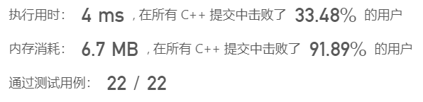
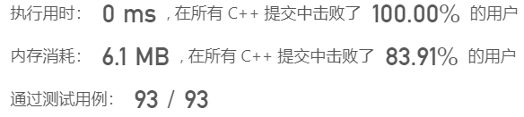
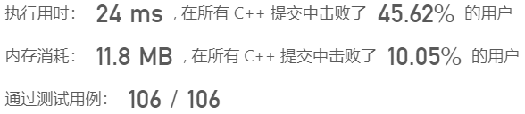

- [三、栈与队列](#三栈与队列)
  - [1、用栈实现队列（20230719，232题，简单）](#1用栈实现队列20230719232题简单)
  - [2、用队列实现栈（20230720，225题，简单）](#2用队列实现栈20230720225题简单)
- [](#)
  - [3、有效的括号（20230724，20题，简单）](#3有效的括号2023072420题简单)
- [](#-1)
  - [4、删除字符串中的所有相邻重复项（20230725，1047题，简单）](#4删除字符串中的所有相邻重复项202307251047题简单)
- [](#-2)
  - [5、逆波兰表达式求值（20230726，150题，中等）](#5逆波兰表达式求值20230726150题中等)

## 三、栈与队列  

### 1、用栈实现队列（20230719，232题，简单）
请你仅使用两个栈实现先入先出队列。队列应当支持一般队列支持的所有操作（push、pop、peek、empty）：


实现 MyQueue 类：
- void push(int x) 将元素 x 推到队列的末尾
- int pop() 从队列的开头移除并返回元素
- int peek() 返回队列开头的元素
- boolean empty() 如果队列为空，返回 true ；否则，返回 false

说明：
- 你 只能 使用标准的栈操作 —— 也就是只有 push to top, peek/pop from top, size, 和 is empty 操作是合法的。
- 你所使用的语言也许不支持栈。你可以使用 list 或者 deque（双端队列）来模拟一个栈，只要是标准的栈操作即可。

进阶：

- 你能否实现每个操作均摊时间复杂度为 O(1) 的队列？换句话说，执行 n 个操作的总时间复杂度为 O(n) ，即使其中一个操作可能花费较长时间。

>自己看答案版本，对C++栈声明和函数不熟悉

```C++ {.line-numbers}
class MyQueue {  
public:

    stack<int> stackIn,stackOut;  //用两个栈实现，两个栈同等地位

    void Use2Tmp()   //不用参数，类中的函数可以调用成员变量
    {
        while(!stackIn.empty())
        {
            stackOut.push(stackIn.top());
            stackIn.pop();
        }
    }

    MyQueue() {

    }
    
    void push(int x) {       /*正常入栈*/
        stackIn.push(x);
    }
    
    int pop() {       /*使用两个栈A/B，A出现放入B，则B的栈顶即为队列头元素。B出栈，再入栈A*/
        if(stackOut.empty())
        {
            Use2Tmp();
        }
        int val = stackOut.top();
        stackOut.pop();         //栈pop返回的是什么，有返回值？
       return val;
    }
    
    int peek() { /*使用两个栈A/B，A出现放入B，则B的栈顶即为队列头元素*/
        if(stackOut.empty())
        {
            Use2Tmp();
        }
        return stackOut.top();
    }
    
    bool empty() {
        return (stackIn.empty() && stackOut.empty());
    }
};

/**
 * Your MyQueue object will be instantiated and called as such:
 * MyQueue* obj = new MyQueue();
 * obj->push(x);
 * int param_2 = obj->pop();
 * int param_3 = obj->peek();
 * bool param_4 = obj->empty();
 */
```



---

### 2、用队列实现栈（20230720，225题，简单）
请你仅使用两个队列实现一个后入先出（LIFO）的栈，并支持普通栈的全部四种操作（push、top、pop 和 empty）。

实现 MyStack 类：

- void push(int x) 将元素 x 压入栈顶。
- int pop() 移除并返回栈顶元素。
- int top() 返回栈顶元素。
- boolean empty() 如果栈是空的，返回 true ；否则，返回 false 。
 

注意：

- 你只能使用队列的基本操作 —— 也就是 push to back、peek/pop from front、size 和 is empty 这些操作。
- 你所使用的语言也许不支持队列。 你可以使用 list （列表）或者 deque（双端队列）来模拟一个队列 , 只要是标准的队列操作即可。

**进阶**：你能否仅用一个队列来实现栈。

>自己看答案版本，对C++队列声明和函数不熟悉
```C++ {.line-numbers}
/*思路，双队列方法：
队列1为主队列，用于实现各种入栈出栈操作，队列2辅助队列。
每次入队，从队列2入，队列1依次出队列进入队列2。入队完成后，队列2即满足越靠前的是越后面进来的。
最后将队列1和2互换名字，等待相应的操作指令。
*/
class MyStack {
public:
    queue<int> que1;
    queue<int> que2;

    MyStack() {

    }
    void push(int x) {       //从队列2入队列，然后将队列1依次入队列2
        que2.push(x);         /*que2.push() push函数需要入参*/
        while(!que1.empty())  /*que1.empty  empty是函数，别忘记加括号*/
        {
            que2.push(que1.front());   /*que1.top()  队列不是top，是front函数*/
            que1.pop();
        }
        swap(que1,que2);    /*swap()直接互换队列*/
    }
    int pop() {        
        int tmpfront = que1.front();
        que1.pop();
        return tmpfront;
    }
    
    int top() {
        return que1.front();
    }
    
    bool empty() {
        return que1.empty();
    }
};

/**
 * Your MyStack object will be instantiated and called as such:
 * MyStack* obj = new MyStack();
 * obj->push(x);
 * int param_2 = obj->pop();
 * int param_3 = obj->top();
 * bool param_4 = obj->empty();
 */
```


---

### 3、有效的括号（20230724，20题，简单）
给定一个只包括 '('，')'，'{'，'}'，'['，']' 的字符串 s ，判断字符串是否有效。

有效字符串需满足：

- 左括号必须用相同类型的右括号闭合。
- 左括号必须以正确的顺序闭合。
- 每个右括号都有一个对应的相同类型的左括号。
>自己写版本
```C++ {.line-numbers}
/*思路：
1、使用栈来做，按顺序入栈，以各类左括号为基准，每次入栈，若是左括号，计数countA，countB,countC，右边括号（思路不行）
2、遇到有括号，必须和上一个入栈的括号是匹配的，并且一起出栈，否则报错。
*/

class Solution {
public:
    stack<char> stk;
    bool isValid(string s) {
        if(s.empty())
        {
            return false;
        }
        int len = s.size();
        for(int i = 0; i < len; i++)
        {
            stk.push(s[i]);
            switch(s[i])      //Switch-case语句格式，Switch用花括号括起来{case 'A':  执行语句； break；}
            {
                case '(':
                case '[':
                case '{':
                    continue;
                case ')':        //出栈，并判断下一个字符是否匹配此括号，匹配也出栈，否则false
                    stk.pop();
                    if(stk.empty())   //为什么一定要加这一句？下面的if判断不是已经保证top不为空了吗？？？
                    {
                        return false;
                    }
                    if(stk.top() != '(')  //包含了第一个字符就是右括号的情况
                    {
                        return false;
                    }
                    else
                    {
                        stk.pop();
                    }
                    break;             //每个case代码块最后要有break语句！！！
                case ']':        
                    stk.pop();
                    if(stk.empty())
                    {
                        return false;
                    }
                    if(stk.top() != '[')   
                    {
                        return false;
                    }
                    else
                    {
                        stk.pop();
                    }
                    break;
                case '}':         
                    stk.pop();
                    if(stk.empty())
                    {
                        return false;
                    }
                    if(stk.top() != '{')   
                    {
                        return false;
                    }
                    else
                    {
                        stk.pop();
                    }
                    break;
                default:
                    return false;
            }
        }
        if(stk.empty())
        {
            return true;
        }
        else
        {
            return false;
        }
    }
};
```



---

### 4、删除字符串中的所有相邻重复项（20230725，1047题，简单）
给出由小写字母组成的字符串 S，重复项删除操作会选择两个相邻且相同的字母，并删除它们。
在 S 上反复执行重复项删除操作，直到无法继续删除。
在完成所有重复项删除操作后返回最终的字符串。答案保证唯一。  

示例：

- 输入："abbaca"  
输出："ca"  
解释：
例如，在 "abbaca" 中，我们可以删除 "bb" 由于两字母相邻且相同，这是此时唯一可以执行删除操作的重复项。之后我们得到字符串 "aaca"，其中又只有 "aa" 可以执行重复项删除操作，所以最后的字符串为 "ca"。
>自己版本，没通过！！！
```C++ {.line-numbers}
/*
思路：
入栈依次删除
一直重复，直到一次遍历中没有删除操作，用计数器标记。
先写一个处理一次遍历的函数，再多次调用。
入栈后判断相同，两个出栈；tmp字符重复赋值栈顶，再入栈并判断。
*/
class Solution {
public:
    stack<char> stk;
    string removeDuplicates(string s) {
        string tmpStr = s;
        char chPre = '\0';
        char chCur = '\0';
        int len = 0;

        for(int i = 0; i < len; i++)   //不能while(!s.empty())
        {
            chPre = stk.top();
            stk.push(tmpStr[i]);
            i++;
            chCur = stk.top();
            
            if(chCur == chPre && (stk.size() > 1))
            {
                stk.pop();
                stk.pop();
            }
        }
        string ret;
        int j = 0;
        while(!stk.empty())
        {
            ret[j] = stk.top();
            j++;                //别忘了累加j
            stk.pop();
        }
        reverse(ret.begin(),ret.end());
        return ret;
    }
};
```
>根据答案修改后的自己版本
```C++ {.line-numbers}
class Solution {
public:
    stack<char> stk;
    string removeDuplicates(string s) {
        string tmpStr = s;
        char chPre = '\0';
        char chCur = '\0';
        int len = 0;

        len = tmpStr.size(); /*len开始忘记了赋值*/
        for(int i = 0; i < len; i++)   //不能while(!s.empty())
        {
            if(!stk.empty())
            {
                chPre = stk.top();    //必须先判空，不然可能top是空的
            }
            if((tmpStr[i] == chPre) && (stk.size() > 0))
            {
                stk.pop();
            }
            else
            {
                stk.push(tmpStr[i]);
            }            
        }
        string ret;
        while(!stk.empty())
        {
            ret += stk.top(); /*string初始化后只能通过拼接来改变字符串*/
            stk.pop();
        }
        reverse(ret.begin(),ret.end()); /*熟悉string类的接口*/
        return ret;
    }
};
```

>默写答案版本
```C++ {.line-numbers}
class Solution {
public:
    string removeDuplicates(string s) {
        string tmpStr;
        for(char ch : s)  
        {
            if(!tmpStr.empty() && (ch == tmpStr.back()))  //tmpStr.back()取string的栈顶元素！ 
            {
                tmpStr.pop_back();
            }
            else
            {
                tmpStr.push_back(ch);
            }            
        }
        return tmpStr;
    }
};
```

---

### 5、逆波兰表达式求值（20230726，150题，中等）

给你一个字符串数组 tokens ，表示一个根据 逆波兰表示法 表示的算术表达式。
请你计算该表达式。返回一个表示表达式值的整数。

注意：

- 有效的算符为 '+'、'-'、'*' 和 '/' 。
- 每个操作数（运算对象）都可以是一个整数或者另一个表达式。
- 两个整数之间的除法总是 向零截断 。
- 表达式中不含除零运算。
- 输入是一个根据逆波兰表示法表示的算术表达式。
- 答案及所有中间计算结果可以用 32 位 整数表示。
 

示例 1：

- 输入：tokens = ["2","1","+","3","*"]  
输出：9  
解释：该算式转化为常见的中缀算术表达式为：((2 + 1) * 3) = 9  

示例 2：

- 输入：tokens = ["4","13","5","/","+"]  
输出：6  
解释：该算式转化为常见的中缀算术表达式为：(4 + (13 / 5)) = 6

