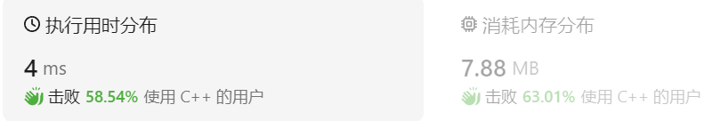

- [一、随想录（共175道题）](#一随想录共175道题)
  - [一、哈希表（8道题）](#一哈希表8道题)
    - [1、两数之和（202300607，232题，简单）](#1两数之和202300607232题简单)
    - [2、四数相加（20230613，454题，中等）](#2四数相加20230613454题中等)
    - [3、赎金信（20230616，383题，简单）](#3赎金信20230616383题简单)
    - [4、三数之和（20230616，15题，中等）](#4三数之和2023061615题中等)
    - [5、用栈实现队列（20230719，232题，简单）](#5用栈实现队列20230719232题简单)
    - [6、用栈实现队列（20230719，232题，简单）](#6用栈实现队列20230719232题简单)
    - [7、用栈实现队列（20230719，232题，简单）](#7用栈实现队列20230719232题简单)
    - [8、用栈实现队列（20230719，232题，简单）](#8用栈实现队列20230719232题简单)
  - [二、链表（7道题）](#二链表7道题)
  - [三、栈与队列（7道题）](#三栈与队列7道题)
    - [1、用栈实现队列（20230719，232题，简单）](#1用栈实现队列20230719232题简单)
    - [2、用队列实现栈（20230720，225题，简单）](#2用队列实现栈20230720225题简单)
    - [3、有效的括号（20230724，20题，简单）](#3有效的括号2023072420题简单)
    - [4、删除字符串中的所有相邻重复项（20230725，1047题，简单）](#4删除字符串中的所有相邻重复项202307251047题简单)
    - [5、逆波兰表达式求值（20230726，150题，中等）](#5逆波兰表达式求值20230726150题中等)
    - [6、滑动窗口最大值（20230731，239题，困难）](#6滑动窗口最大值20230731239题困难)
    - [6、前K个高频元素（20230802，347题，中等）](#6前k个高频元素20230802347题中等)
  - [四、数组（5道题）](#四数组5道题)
    - [1、二分查找（20230807，704题，简单）](#1二分查找20230807704题简单)
    - [2、移除元素（20230808 ，27题，简单）](#2移除元素20230808-27题简单)
    - [3、有序数组的平方（20230808， 977题，简单）](#3有序数组的平方20230808-977题简单)
    - [4、长度最小的子数组（20230809 ，209题，中等）](#4长度最小的子数组20230809-209题中等)
    - [5、螺旋矩阵II（20230818，59题，中等）](#5螺旋矩阵ii2023081859题中等)
    - [6、数组 （202308 ， 题，简单）](#6数组-202308--题简单)
  - [五、字符串（7道题）](#五字符串7道题)
    - [1、字符串反转 （20230821，344题，简单）](#1字符串反转-20230821344题简单)
    - [2、字符串反转 （202308，题，简单）](#2字符串反转-202308题简单)
    - [替换空格 （20230823，5题，简单）](#替换空格-202308235题简单)
    - [4、反转字符串中的单词 （20230823，151题，中等）](#4反转字符串中的单词-20230823151题中等)
    - [5、左旋转字符串 （20230825，剑指 Offer 58 - II题，简单）](#5左旋转字符串-20230825剑指-offer-58---ii题简单)
    - [6、实现 strStr() （20230828，28题，简单）](#6实现-strstr-2023082828题简单)
    - [7、字符串反转 （20230829，459题，简单）](#7字符串反转-20230829459题简单)
  - [六、双指针法（10道题）](#六双指针法10道题)
  - [七、二叉树（32道题）](#七二叉树32道题)
    - [1、二叉树的前序遍历（20231102，144题，简单）](#1二叉树的前序遍历20231102144题简单)
    - [2、二叉树的中序遍历（20231106，94题，简单）](#2二叉树的中序遍历2023110694题简单)
    - [3、二叉树的后序遍历（20231106，145题，简单）](#3二叉树的后序遍历20231106145题简单)
    - [4、二叉树的前、中、后序遍历统一方法（20231107）](#4二叉树的前中后序遍历统一方法20231107)
    - [5、二叉树的层序遍历（20231106，102题，中等）](#5二叉树的层序遍历20231106102题中等)
    - [6、翻转二叉树（20231109，226题，简单）](#6翻转二叉树20231109226题简单)
    - [7、对称二叉树（20231109，101题，简单）](#7对称二叉树20231109101题简单)
    - [8、二叉树的最大深度（20231110，104题，简单）](#8二叉树的最大深度20231110104题简单)
    - [9、二叉树的最小深度（20231212，111题，简单）](#9二叉树的最小深度20231212111题简单)
    - [10、完全二叉树的节点个数（20231213，222题，简单）](#10完全二叉树的节点个数20231213222题简单)
    - [11、平衡二叉树（20231220，110题，简单）](#11平衡二叉树20231220110题简单)
    - [12、二叉树的所有路径（20231220，257题，简单）](#12二叉树的所有路径20231220257题简单)
    - [13、左叶子之和（20231221，404题，简单）](#13左叶子之和20231221404题简单)
    - [14、找树左下角的值（20231221，513题，中等）](#14找树左下角的值20231221513题中等)
    - [15、路径总和（20231221，112题，简单）](#15路径总和20231221112题简单)
  - [八、动态规划（52道题）](#八动态规划52道题)
    - [1、斐波那契数（20231025，509题，简单）](#1斐波那契数20231025509题简单)
    - [2、爬楼梯（20231026，70题，简单）](#2爬楼梯2023102670题简单)
    - [3、使用最小花费爬楼梯（20231026，746题，简单）](#3使用最小花费爬楼梯20231026746题简单)
    - [4、不同路径（20231027，62题，中等）](#4不同路径2023102762题中等)
  - [](#)
    - [5、不同路径 II（20231027，63题，中等）](#5不同路径-ii2023102763题中等)
    - [6、 整数拆分（20231116，343题，中等）](#6-整数拆分20231116343题中等)
    - [7、 不同的二叉搜索树（20231121，96题，中等）](#7-不同的二叉搜索树2023112196题中等)
  - [九、贪心算法（22道题）](#九贪心算法22道题)
    - [1、分发饼干（20231010，455题，简单）](#1分发饼干20231010455题简单)
    - [2、最大子数组和（20231017，53题，中等）](#2最大子数组和2023101753题中等)
    - [3、买卖股票的最佳时机 II（20231017，122题，中等）](#3买卖股票的最佳时机-ii20231017122题中等)
    - [4、跳跃游戏（20231017，55题，中等）](#4跳跃游戏2023101755题中等)
    - [5、跳跃游戏 II（20231017，45题，中等）](#5跳跃游戏-ii2023101745题中等)
    - [6、 K次取反后最大化的数组和（20231017， 1005题，简单）](#6-k次取反后最大化的数组和20231017-1005题简单)
    - [7、加油站（20231116，134题，中等）](#7加油站20231116134题中等)
    - [8、分发糖果（20231129，135题，困难）](#8分发糖果20231129135题困难)
    - [9、柠檬水找零（20231201，860题，简单）](#9柠檬水找零20231201860题简单)
  - [十、回溯算法（20道题）](#十回溯算法20道题)
    - [1、组合（20231020，77题，中等）](#1组合2023102077题中等)
    - [2、组合总和III（20231020，216题，中等）](#2组合总和iii20231020216题中等)
    - [3、电话号码的字母组合（20231020，17题，中等）](#3电话号码的字母组合2023102017题中等)
    - [4、组合总和（20231024，39题，中等）](#4组合总和2023102439题中等)
    - [5、组合总和II（20231110，40题，中等）](#5组合总和ii2023111040题中等)
    - [6、分割回文串（20231110，131题，中等）](#6分割回文串20231110131题中等)
    - [7、复原 IP 地址（20231201，93题，中等）](#7复原-ip-地址2023120193题中等)
    - [8、子集（20231205，78题，中等）](#8子集2023120578题中等)
    - [9、子集II（20231212，90题，中等）](#9子集ii2023121290题中等)
  - [十一、单调栈（5道题）](#十一单调栈5道题)
    - [1、组合总和（2023 ， 题，中等）](#1组合总和2023--题中等)

# 一、随想录（共175道题）

之前的在哪，路径找到放这里
/*************************************************************************/

## 一、哈希表（8道题）
### 1、两数之和（202300607，232题，简单）
给定一个整数数组 nums 和一个整数目标值 target，请你在该数组中找出 和为目标值 target  的那 两个 整数，并返回它们的数组下标。  
你可以假设每种输入只会对应一个答案。但是，数组中同一个元素在答案里不能重复出现。  
你可以按任意顺序返回答案。

**示例 1**：
- 输入：nums = [2,7,11,15], target = 9
- 输出：[0,1]
- 解释：因为 nums[0] + nums[1] == 9 ，返回 [0, 1] 。
  
**示例 2**：
- 输入：nums = [3,2,4], target = 6
- 输出：[1,2]
  
**示例 3**：
- 输入：nums = [3,3], target = 6
- 输出：[0,1]

 >参考答案
 ```C++ {.line-numbers}
 /*
思路：
定义一个hash表用于存储这张表。
在hash表中查找target - nums[i]，存在说明找到了，返回；
没找到，则将这个nums[i]存入hash表。

a+b=target
一边找一边将当前找的数字放入hash表中，暂时没找到b没关系，等找a的时候，也一样能得到答案！！！
*/
 class Solution {
    public:
        vector<int> twoSum(vector<int>& nums, int target) 
        {
            unordered_map<int, int> hashtable;
            for(int i = 0; i < nums.size(); ++i)
            {
                auto it = hashtable.find(target - nums[i]);    //开始表中什么都没有，但是也要查找target - nums[i]是否存在于数组中。find()返回的是指针（迭代器）
                if(it != hashtable.end())         //找到了这个数，且不是数组末尾，则表明找到了这个数。
                {
                    return {it->second, i};       //it->first表示键值（索引或者key），it->second表示数值。
                }
                hashtable[nums[i]] = i;    //哈希表的键值就是原数组的数值nums[i]。
            }
            return {};      //注意返回的形式，vector初始化可以使用{}，所以返回这个，表示空。？
        }
    };
 ```


### 2、四数相加（20230613，454题，中等）
给你四个整数数组 nums1、nums2、nums3 和 nums4 ，数组长度都是 n ，请你计算有多少个元组 (i, j, k, l) 能满足：

0 <= i, j, k, l < n
nums1[i] + nums2[j] + nums3[k] + nums4[l] == 0
 
**示例 1**：

- 输入：nums1 = [1,2], nums2 = [-2,-1], nums3 = [-1,2], nums4 = [0,2]
- 输出：2
- 解释：  
两个元组如下：
1. (0, 0, 0, 1) -> nums1[0] + nums2[0] + nums3[0] + nums4[1] = 1 + (-2) + (-1) + 2 = 0
2. (1, 1, 0, 0) -> nums1[1] + nums2[1] + nums3[0] + nums4[0] = 2 + (-1) + (-1) + 0 = 0

**示例 2**：

- 输入：nums1 = [0], nums2 = [0], nums3 = [0], nums4 = [0]
- 输出：1
>看答案
```C++ {.line-numbers}
/*
思路：
分成两组，一组记录AB两个数组的两两之和，另一组CD的。
若第二组出现了（0-AB），即-AB，则说明找到了一组。
*/
class Solution {
public:
    int fourSumCount(vector<int>& nums1, vector<int>& nums2, vector<int>& nums3, vector<int>& nums4) 
{
    int countSum = 0;
    //求解AB的两两之和
    unordered_map<int, int> mapAB;
    int countAB = 0;
    for(int i = 0; i < nums1.size(); ++i)
    {
        for(int j = 0; j < nums2.size(); ++j)
        {
            ++mapAB[nums1[i] + nums2[j]]; //记录这个和出现的次数
        }
    }
    //求解CD的两两之和
    unordered_map<int, int> mapCD;
    //vector<int> vecCD;

    int countCD = 0;
    for(int m = 0; m < nums3.size(); ++m)
    {
        for(int n = 0; n < nums4.size(); ++n)
        {
            auto it = mapAB.find(-(nums3[m] + nums4[n]));  //在AB数组中找是否有-CD的数值
            if(it != mapAB.end())   //找到了。end可能另find找到对应的数嘛？
            {
                countSum += mapAB[-(nums3[m] + nums4[n])];  //统计AB中有多少个这样的数值
            }
            countCD++;  //这个计数是干嘛的？
        }
    }
    return countSum;
}
};
```


### 3、赎金信（20230616，383题，简单）
给你两个字符串：ransomNote 和 magazine ，判断 ransomNote 能不能由 magazine 里面的字符构成。  
如果可以，返回 true ；否则返回 false 。  
magazine 中的每个字符只能在 ransomNote 中使用一次。

**示例 1**：

- 输入：ransomNote = "a", magazine = "b"
- 输出：false

**示例 2**：

- 输入：ransomNote = "aa", magazine = "ab"
- 输出：false

**示例 3**：

- 输入：ransomNote = "aa", magazine = "aab"
- 输出：true
>自己版本
```C++ {.line-numbers}
/*
思路：
利用hashmap存储ransomnote，记录每个字母出现的次数。
在hashmap中查找magazine中的字母，没找到则返回false；找到了就对这个字母次数减一，若次数小于0，返回false

128 / 128 个通过测试用例
状态：通过
执行用时: 16 ms
内存消耗: 8.4 MB

class Solution {
public:
    bool canConstruct(string ransomNote, string magazine) 
    {
        unordered_map<int, int> hashtable;
        for(auto i : magazine)
        {
            ++hashtable[i];
        }
        for(auto j : ransomNote)
        {
            --hashtable[j];
            if(hashtable[j] < 0)
            {
                return false;
            }
        }
        return true;
    }
};

*/
```
>看答案
```C++ {.line-numbers}
class Solution {
public:
    bool canConstruct(string ransomNote, string magazine) 
    {
        if(ransomNote.size() > magazine.size())
        {
            return false;
        }
        vector<int> vectable(26);    //是花括号，不是方括号！
        for(auto & i : magazine)   //使用引用可以减少空间浪费
        {
            ++vectable[i - 'a'];
        }
        for(auto & j : ransomNote)
        {
            --vectable[j - 'a'];
            if(vectable[j - 'a'] < 0)   //这里也是j - 'a'，而不是j
            {
                return false;
            }
        }
        return true;
    }
};
```

### 4、三数之和（20230616，15题，中等）
给你一个整数数组 nums ，判断是否存在三元组 [nums[i], nums[j], nums[k]] 满足 i != j、i != k 且 j != k ，同时还满足 nums[i] + nums[j] + nums[k] == 0 。请

你返回所有和为 0 且不重复的三元组。

注意：答案中不可以包含重复的三元组。

**示例 1**：

- 输入：nums = [-1,0,1,2,-1,-4]
- 输出：[[-1,-1,2],[-1,0,1]]
- 解释：
nums[0] + nums[1] + nums[2] = (-1) + 0 + 1 = 0 。
nums[1] + nums[2] + nums[4] = 0 + 1 + (-1) = 0 。
nums[0] + nums[3] + nums[4] = (-1) + 2 + (-1) = 0 。
不同的三元组是 [-1,0,1] 和 [-1,-1,2] 。
注意，输出的顺序和三元组的顺序并不重要。

**示例 2**：

- 输入：nums = [0,1,1]
- 输出：[]
- 解释：唯一可能的三元组和不为 0 。

**示例 3**：

- 输入：nums = [0,0,0]
- 输出：[[0,0,0]]
- 解释：唯一可能的三元组和为 0 。
>看答案
```C++ {.line-numbers}
class Solution {
public:
    vector<vector<int>> threeSum(vector<int>& nums) {
        int n = nums.size();
        sort(nums.begin(), nums.end());
        vector<vector<int>> ans;
        // 枚举 a
        for (int first = 0; first < n; ++first) {
            // 需要和上一次枚举的数不相同
            if (first > 0 && nums[first] == nums[first - 1]) {
                continue;
            }
            // c 对应的指针初始指向数组的最右端
            int third = n - 1;
            int target = -nums[first];
            // 枚举 b
            for (int second = first + 1; second < n; ++second) {
                // 需要和上一次枚举的数不相同
                if (second > first + 1 && nums[second] == nums[second - 1]) {
                    continue;
                }
                // 需要保证 b 的指针在 c 的指针的左侧
                while (second < third && nums[second] + nums[third] > target) {
                    --third;
                }
                // 如果指针重合，随着 b 后续的增加
                // 就不会有满足 a+b+c=0 并且 b<c 的 c 了，可以退出循环
                if (second == third) {
                    break;
                }
                if (nums[second] + nums[third] == target) {
                    ans.push_back({nums[first], nums[second], nums[third]});
                }
            }
        }
        return ans;
    }
};
```
>看答案自己写的
```C++ {.line-numbers}
/*
312 / 312 个通过测试用例
状态：通过
执行用时: 148 ms
内存消耗: 23.4 MB

时间复杂度：O(N^2)
空间复杂度：O(logN)
 
开始错误思路：
计算两两数之和，看第三个数是否能够使得其和为0；
问题在于，如何不使用重复数字：如第一个和第二个数字之和，后面可能和第一个数字匹配到和为0.

官方题解思路：
1、为了不包含重复的三元组，需要对数组进行排序；且第二第三循环所取数字不能和上一个重复
2、由于在a固定的情况下，a+b+c = 0中，b和c存在关系，b增大，c减小；所以在循环中可以设计一下，减少一层循环
3、循环结束条件，如b<c。
4、双指针法，需要考虑全面两个指针的情况，如指针2在指针1的右边，左边，和重合的情况。
*/

class Solution {
public:
    vector<vector<int>> threeSum(vector<int>& nums) {
        vector<vector<int>> ans;   //存储最后返回的符合条件的元组
        int n = nums.size();
        sort(nums.begin(),nums.end());    //先对数组进行排序

        //对a进行遍历
        for(int i = 0; i < n ; ++i)
        {
            if(i > 0 && nums[i] == nums[i - 1])  //每次循环不取和上一个重复的数字
            {
                continue;
            }
            //对c进行遍历
            int k = n - 1;
            //对b进行遍历
            for(int j = i + 1; j < n; ++j)
            {
                if(j > i + 1 && nums[j] == nums[j - 1])  //是j > i + 1。不是j > 0
                {
                    continue;
                }                
                while(j < k && nums[i] + nums[j] + nums[k] > 0)  //保证j < k，即b在c的左边
                {
                    k = k - 1;
                }
                if(j == k)
                {
                    break;  //不是continue，重合后，b继续增加，也不可能和等于0,。之后就是b>c的情况了。
                }
                if(nums[i] + nums[j] + nums[k] == 0)
                {
                    ans.push_back({nums[i], nums[j], nums[k]});  //不是{i, k, k}
                }

            }
        }
        return ans;
    }
};
```


### 5、用栈实现队列（20230719，232题，简单）

### 6、用栈实现队列（20230719，232题，简单）

### 7、用栈实现队列（20230719，232题，简单）

### 8、用栈实现队列（20230719，232题，简单）


## 二、链表（7道题）

## 三、栈与队列（7道题）

### 1、用栈实现队列（20230719，232题，简单）
请你仅使用两个栈实现先入先出队列。队列应当支持一般队列支持的所有操作（push、pop、peek、empty）：


实现 MyQueue 类：
- void push(int x) 将元素 x 推到队列的末尾
- int pop() 从队列的开头移除并返回元素
- int peek() 返回队列开头的元素
- boolean empty() 如果队列为空，返回 true ；否则，返回 false

说明：
- 你 只能 使用标准的栈操作 —— 也就是只有 push to top, peek/pop from top, size, 和 is empty 操作是合法的。
- 你所使用的语言也许不支持栈。你可以使用 list 或者 deque（双端队列）来模拟一个栈，只要是标准的栈操作即可。

进阶：

- 你能否实现每个操作均摊时间复杂度为 O(1) 的队列？换句话说，执行 n 个操作的总时间复杂度为 O(n) ，即使其中一个操作可能花费较长时间。

>自己看答案版本，对C++栈声明和函数不熟悉

```C++ {.line-numbers}
class MyQueue {  
public:

    stack<int> stackIn,stackOut;  //用两个栈实现，两个栈同等地位

    void Use2Tmp()   //不用参数，类中的函数可以调用成员变量
    {
        while(!stackIn.empty())
        {
            stackOut.push(stackIn.top());
            stackIn.pop();
        }
    }

    MyQueue() {

    }
    
    void push(int x) {       /*正常入栈*/
        stackIn.push(x);
    }
    
    int pop() {       /*使用两个栈A/B，A出现放入B，则B的栈顶即为队列头元素。B出栈，再入栈A*/
        if(stackOut.empty())
        {
            Use2Tmp();
        }
        int val = stackOut.top();
        stackOut.pop();         //栈pop返回的是什么，有返回值？
       return val;
    }
    
    int peek() { /*使用两个栈A/B，A出现放入B，则B的栈顶即为队列头元素*/
        if(stackOut.empty())
        {
            Use2Tmp();
        }
        return stackOut.top();
    }
    
    bool empty() {
        return (stackIn.empty() && stackOut.empty());
    }
};

/**
 * Your MyQueue object will be instantiated and called as such:
 * MyQueue* obj = new MyQueue();
 * obj->push(x);
 * int param_2 = obj->pop();
 * int param_3 = obj->peek();
 * bool param_4 = obj->empty();
 */
```


---

### 2、用队列实现栈（20230720，225题，简单）
请你仅使用两个队列实现一个后入先出（LIFO）的栈，并支持普通栈的全部四种操作（push、top、pop 和 empty）。

实现 MyStack 类：

- void push(int x) 将元素 x 压入栈顶。
- int pop() 移除并返回栈顶元素。
- int top() 返回栈顶元素。
- boolean empty() 如果栈是空的，返回 true ；否则，返回 false 。
 

注意：

- 你只能使用队列的基本操作 —— 也就是 push to back、peek/pop from front、size 和 is empty 这些操作。
- 你所使用的语言也许不支持队列。 你可以使用 list （列表）或者 deque（双端队列）来模拟一个队列 , 只要是标准的队列操作即可。

**进阶**：你能否仅用一个队列来实现栈。

>自己看答案版本，对C++队列声明和函数不熟悉
```C++ {.line-numbers}
/*思路，双队列方法：
队列1为主队列，用于实现各种入栈出栈操作，队列2辅助队列。
每次入队，从队列2入，队列1依次出队列进入队列2。入队完成后，队列2即满足越靠前的是越后面进来的。
最后将队列1和2互换名字，等待相应的操作指令。
*/
class MyStack {
public:
    queue<int> que1;
    queue<int> que2;

    MyStack() {

    }
    void push(int x) {       //从队列2入队列，然后将队列1依次入队列2
        que2.push(x);         /*que2.push() push函数需要入参*/
        while(!que1.empty())  /*que1.empty  empty是函数，别忘记加括号*/
        {
            que2.push(que1.front());   /*que1.top()  队列不是top，是front函数*/
            que1.pop();
        }
        swap(que1,que2);    /*swap()直接互换队列*/
    }
    int pop() {        
        int tmpfront = que1.front();
        que1.pop();
        return tmpfront;
    }
    
    int top() {
        return que1.front();
    }
    
    bool empty() {
        return que1.empty();
    }
};

/**
 * Your MyStack object will be instantiated and called as such:
 * MyStack* obj = new MyStack();
 * obj->push(x);
 * int param_2 = obj->pop();
 * int param_3 = obj->top();
 * bool param_4 = obj->empty();
 */
```


---

### 3、有效的括号（20230724，20题，简单）
给定一个只包括 '('，')'，'{'，'}'，'['，']' 的字符串 s ，判断字符串是否有效。

有效字符串需满足：

- 左括号必须用相同类型的右括号闭合。
- 左括号必须以正确的顺序闭合。
- 每个右括号都有一个对应的相同类型的左括号。
  
>自己写版本
```C++ {.line-numbers}
/*思路：
1、使用栈来做，按顺序入栈，以各类左括号为基准，每次入栈，若是左括号，计数countA，countB,countC，右边括号（思路不行）
2、遇到有括号，必须和上一个入栈的括号是匹配的，并且一起出栈，否则报错。
*/

class Solution {
public:
    stack<char> stk;
    bool isValid(string s) {
        if(s.empty())
        {
            return false;
        }
        int len = s.size();
        for(int i = 0; i < len; i++)
        {
            stk.push(s[i]);
            switch(s[i])      //Switch-case语句格式，Switch用花括号括起来{case 'A':  执行语句； break；}
            {
                case '(':
                case '[':
                case '{':
                    continue;
                case ')':        //出栈，并判断下一个字符是否匹配此括号，匹配也出栈，否则false
                    stk.pop();
                    if(stk.empty())   //为什么一定要加这一句？下面的if判断不是已经保证top不为空了吗？？？
                    {
                        return false;
                    }
                    if(stk.top() != '(')  //包含了第一个字符就是右括号的情况
                    {
                        return false;
                    }
                    else
                    {
                        stk.pop();
                    }
                    break;             //每个case代码块最后要有break语句！！！
                case ']':        
                    stk.pop();
                    if(stk.empty())
                    {
                        return false;
                    }
                    if(stk.top() != '[')   
                    {
                        return false;
                    }
                    else
                    {
                        stk.pop();
                    }
                    break;
                case '}':         
                    stk.pop();
                    if(stk.empty())
                    {
                        return false;
                    }
                    if(stk.top() != '{')   
                    {
                        return false;
                    }
                    else
                    {
                        stk.pop();
                    }
                    break;
                default:
                    return false;
            }
        }
        if(stk.empty())
        {
            return true;
        }
        else
        {
            return false;
        }
    }
};
```


---

### 4、删除字符串中的所有相邻重复项（20230725，1047题，简单）
给出由小写字母组成的字符串 S，重复项删除操作会选择两个相邻且相同的字母，并删除它们。
在 S 上反复执行重复项删除操作，直到无法继续删除。
在完成所有重复项删除操作后返回最终的字符串。答案保证唯一。  

示例：

- 输入："abbaca"  
输出："ca"  
解释：
例如，在 "abbaca" 中，我们可以删除 "bb" 由于两字母相邻且相同，这是此时唯一可以执行删除操作的重复项。之后我们得到字符串 "aaca"，其中又只有 "aa" 可以执行重复项删除操作，所以最后的字符串为 "ca"。
>自己版本，没通过！！！
```C++ {.line-numbers}
/*
思路：
入栈依次删除
一直重复，直到一次遍历中没有删除操作，用计数器标记。
先写一个处理一次遍历的函数，再多次调用。
入栈后判断相同，两个出栈；tmp字符重复赋值栈顶，再入栈并判断。
*/
class Solution {
public:
    stack<char> stk;
    string removeDuplicates(string s) {
        string tmpStr = s;
        char chPre = '\0';
        char chCur = '\0';
        int len = 0;

        for(int i = 0; i < len; i++)   //不能while(!s.empty())
        {
            chPre = stk.top();
            stk.push(tmpStr[i]);
            i++;
            chCur = stk.top();
            
            if(chCur == chPre && (stk.size() > 1))
            {
                stk.pop();
                stk.pop();
            }
        }
        string ret;
        int j = 0;
        while(!stk.empty())
        {
            ret[j] = stk.top();
            j++;                //别忘了累加j
            stk.pop();
        }
        reverse(ret.begin(),ret.end());
        return ret;
    }
};
```
>根据答案修改后的自己版本
```C++ {.line-numbers}
class Solution {
public:
    stack<char> stk;
    string removeDuplicates(string s) {
        string tmpStr = s;
        char chPre = '\0';
        char chCur = '\0';
        int len = 0;

        len = tmpStr.size(); /*len开始忘记了赋值*/
        for(int i = 0; i < len; i++)   //不能while(!s.empty())
        {
            if(!stk.empty())
            {
                chPre = stk.top();    //必须先判空，不然可能top是空的
            }
            if((tmpStr[i] == chPre) && (stk.size() > 0))
            {
                stk.pop();
            }
            else
            {
                stk.push(tmpStr[i]);
            }            
        }
        string ret;
        while(!stk.empty())
        {
            ret += stk.top(); /*string初始化后只能通过拼接来改变字符串*/
            stk.pop();
        }
        reverse(ret.begin(),ret.end()); /*熟悉string类的接口*/
        return ret;
    }
};
```

>默写答案版本
```C++ {.line-numbers}
class Solution {
public:
    string removeDuplicates(string s) {
        string tmpStr;
        for(char ch : s)  
        {
            if(!tmpStr.empty() && (ch == tmpStr.back()))  //tmpStr.back()取string的栈顶元素！ 
            {
                tmpStr.pop_back();
            }
            else
            {
                tmpStr.push_back(ch);
            }            
        }
        return tmpStr;
    }
};
```


---

### 5、逆波兰表达式求值（20230726，150题，中等）

给你一个字符串数组 tokens ，表示一个根据 逆波兰表示法 表示的算术表达式。
请你计算该表达式。返回一个表示表达式值的整数。

注意：

- 有效的算符为 '+'、'-'、'*' 和 '/' 。
- 每个操作数（运算对象）都可以是一个整数或者另一个表达式。
- 两个整数之间的除法总是 向零截断 。
- 表达式中不含除零运算。
- 输入是一个根据逆波兰表示法表示的算术表达式。
- 答案及所有中间计算结果可以用 32 位 整数表示。
 

示例 1：

- 输入：tokens = ["2","1","+","3","*"]  
输出：9  
解释：该算式转化为常见的中缀算术表达式为：((2 + 1) * 3) = 9  

示例 2：

- 输入：tokens = ["4","13","5","/","+"]  
输出：6  
解释：该算式转化为常见的中缀算术表达式为：(4 + (13 / 5)) = 6
>自己写，漏洞百出版本
```C++ {.line-numbers}
/*
思路：
依次入栈，直到遇到运算符，出栈两个字符串，并运算。
将结果入栈，继续等待下一个运算符
*/
class Solution {
public:
    int evalRPN(vector<string>& tokens) {
        //stack<string> tmp;
        vector<string> tmp;
        int firstNum = 0;
        int SecNum = 0;
        int Sum = 0;
        int len = tokens.size();

        for(int i = 0; i < len; i++)
        {
            tmp.push_back(tokens[i]);   /*这个元素已经入栈，栈中至少保证有三个字符串，tmp.size() < 3才对*/
            if(tmp.size() < 3 )         //栈中至少有两个字符串，第三个是运算符，才能进行运算    
            {
                continue;
            }
            switch(tmp.back())   /*switc语句不能用于字符串，只能用整数、枚举或字符。但是可以用str[0] == "+"来判断*/
            {
                case '+':                    //如果是字符串，则出栈两个
                firstNum = stoi(tmp.back());
                tmp.erase(tmp.end() - 1);   /*tmp.end() - 1才是指向最后一个元素，tmp.end()指向的最后元素之后*/ 
                SecNum = stoi(tmp.back());
                tmp.erase(tmp.end() - 1); 
                Sum = firstNum + SecNum;   /*sum不需要累加，运算完入栈就行*/   
                tmp.push_back(atoi(Sum));  /*sum忘记入栈，这里就能看出栈应该用int类型的*/
                break;

                case '-':
                firstNum = stoi(tmp.back());
                tmp.erase(tmp.end() - 1);
                SecNum = stoi(tmp.back());
                tmp.erase(tmp.end() - 1); 
                Sum = firstNum - SecNum;  
                tmp.push_back(atoi(Sum));
                break;

                case '*':
                firstNum = stoi(tmp.back());
                tmp.erase(tmp.end() - 1);
                SecNum = stoi(tmp.back());
                tmp.erase(tmp.end() - 1); 
                Sum = firstNum * SecNum;
                tmp.push_back(atoi(Sum));
                break;

                case '/':
                firstNum = stoi(tmp.back());
                tmp.erase(tmp.end() - 1);
                SecNum = stoi(tmp.back());
                tmp.erase(tmp.end() - 1); 
                Sum = firstNum / SecNum; 
                tmp.push_back(atoi(Sum));
                break;

                default:
                continue;
            }
            
        }
        return tmp.front();
    }
};

```
>根据ChatGPT4改写答案
```C++ {.line-numbers}
/*
思路：
依次入栈，直到遇到运算符，出栈两个字符串，并运算。
将结果入栈，继续等待下一个运算符
临时的栈使用int类型的数据接收。
*/
class Solution {
public:
    int evalRPN(vector<string>& tokens) {
        vector<int> tmp;    /*注意定义的tmp数据类型，后续代码要匹配*/
        int firstNum = 0;
        int SecNum = 0;
        int Sum = 0;

        for(auto &str :  tokens) /*str使用引用，减少内存*/
        {
            if((str == "+") || (str == "-") || (str == "*") || (str == "/"))
            {
                SecNum = tmp.back();   /*第二个数字，即运算符右边的数字，是先出栈的！*/
                tmp.pop_back();
                firstNum = tmp.back(); /*第一个数字，即运算符左边的数字，是后出栈的！*/
                tmp.pop_back();
                if(str == "+")      Sum = firstNum + SecNum;
                else if(str == "-") Sum = firstNum - SecNum;
                else if(str == "*") Sum = firstNum * SecNum;
                else(str == "/")    Sum = firstNum / SecNum;
                tmp.push_back(Sum);
            }
            else
            {
                tmp.push_back(stoi(str));
            }
        }
        return tmp.front();
    }
};
```


---

### 6、滑动窗口最大值（20230731，239题，困难）
给定一个数组 nums，有一个大小为 k 的滑动窗口从数组的最左侧移动到数组的最右侧。你只可以看到在滑动窗口内的 k 个数字。滑动窗口每次只向右移动一位。
返回滑动窗口中的**最大值**。

**进阶**：
你能在线性时间复杂度内解决此题吗？


>自己写，漏洞百出版本
```C++ {.line-numbers}
/*
思路1：
依次获取nums中的数据，收集到K个后进行排序。
取最大值，并剔除第一个数据，随后取下一个数据，进行重复操作。
思路2：
依次取数值后，记录当前最大值a。
取到K个数值为止，当前最大值a1在索引i处，继续往后去若干，直至i+k处。
    1）此前若未遇到大于a1的数值，则输出K个a1；
    2）若遇到更大的数值，在i+m处遇到（m<k），则输出i+m-k或者m的较小值（因为a1可能在索引小于K处），一直检索至最后数据
    情况1中，需要取a1后的第K个数字，继续找其后最大的K个数字内的最大值。
    情况2中，依次处理就行，注意索引值的边界。
使用栈stk存储遍历的nums，临时变量count记录最大值应该出现的次数。
    从第一个数开始，就可以以这个数为基准去找。只是注意初始的前K个的特殊点，要满足框柱K个开始计数。
    当索引大于K时，只要找到大于当前最大数时即可停止，计算相隔多少个数字，然后将其入栈stk2。
思路3：
    细分情况较多，a在K内或K外；找到或没找到b；找到的b在K内或K外；没找到b。
    分析后可结合为找到或者没找到b两种情况。用较小的索引来控制a入栈次数。
给ChatGPT的：我的思路是以一个数字a为基准，往后找更大的数b（只会往后找k个数），找到b，就将一定数量的a存入容器vec2中；没找到b，就将a放入容器vec2 k次，然后将后面那个数作为新的基准。
*/

class Solution {
public:
    vector<int> maxSlidingWindow(vector<int>& nums, int k) {
        //vector<int> vec1;
        vector<int> vec2;   //用于存输出数据
        int indexMaxNum = 0;
        int MaxNew = 0;
        int isFirst = 1;
        int len = nums.size();
        int j = 0;
        int tmp = 0;

        for(int i = 0; i < len; i++)
        {
            j++;              //判断j等于6，即在没找到b时情况时，做相应处理
            tmp = nums[i];
            if(isFirst)       //以第一个数作为基点
            {
                MaxNew = tmp;
                indexMaxNum = i;
                isFirst = 0;
            }
            if(1 == len)  //只有一个数字的情况
            {
                vec2.push_back(nums[indexMaxNum]); 
                return vec2;
            }
            if(tmp >= MaxNew )   //找到一个大于当前的数字.需要考虑最后的数字最大且需要输出的情况
            {

                int count1 = (i - k) > 0 ? (i - k): 0;     //负数-4也算true。。
                int count2 = (i - indexMaxNum) > 0 ? (i - indexMaxNum): 0;
                while(count1 && count2)           //包括了b在K内或者外的情况，有一种为零，则之前的较大数不能入栈vec2
                {
                    vec2.push_back(nums[indexMaxNum]);  
                    count1--;
                    count2--;
                }
                MaxNew = tmp;     //要先把之前的大数存近栈，然后再重新赋值
                indexMaxNum = i;  //要先把之前的大数存近栈，然后再重新赋值
                j = 0;      //找到新的大数，则重新计数
            }
            //|| (i == len - 1)
            if(j == k - 1 )   //往后找k个数都没找到，则入栈K次，将当前数作为新基点。考虑到最后但没慢K个数，切没找到b
            {
                int count3 = (i - k + 2) > 0 ? (i - k + 2): 0;    //得加上1，新大数本身位置也要算一次
                int count4 = (i - indexMaxNum + 2) > 0 ? (i - indexMaxNum + 2): 0;
                while(count3 && count4)
                {
                    vec2.push_back(nums[indexMaxNum]);     
                    count3--;
                    count4--;
                }

                isFirst = 1;  //让下次入栈的数据重新当做新的基点
                j = 0;      //找到后面第k个数还没找到新的大数，则重新计数
            }
           if(i == len - 1)   //往后找k个数都没找到，则入栈K次，将当前数作为新基点。考虑到最后但没慢K个数，切没找到b
            {
                //给最后的数字打上补丁
                vec2.push_back(nums[i]); 
            }
        }
        return vec2;
    }
};
```
>根据答案修改的版本，使用双端队列deque
```C++ {.line-numbers}
/*
思路：
使用双端队列deque，存放nums[]的索引。
想要每次滑动窗口，则确定一个数字。
首先for循环确认前K个数中数据，定制规则如下：
    依次比对nums[i]，入队列的数只能比
    之后从K开始，遍历nums[i]，nums[i]大于队尾索引对应的值时，令队列依次后端出列。
    这样保持了队列始终是右大到小的，队头索引x最大，其后的预备队员也不会被舍弃，将在x小于i-k后，依次充当大王。
之后从K开始循环遍历nums[i]，保持队列的由大到小的性质，依次将队头的数存储在vec中，最后返回vec。
理解：
deque要存放nums[i]的索引，因为索引不仅能够唯一确定它的值，还能由索引确认数值的位置。
首次for循环K个后，双端队列已经是个窗口了，只是我们可以给这个窗口中的元素定制规则，方便找到所需数据。
*/
class Solution {
public:
    vector<int> maxSlidingWindow(vector<int>& nums, int k) {
        deque<int> dq;
        vector<int> ret;
        int len = nums.size();
        for(int i = 0; i < k; i++)
        {
            /*if(!deque.empty() && nums[i] >= nums[deque.back()]),直接while就行，不用这句if，画蛇添足了！*/
            while(!dq.empty() && nums[i] >= nums[dq.back()]) /*deque是数据类型，用的时候用它的对象dq*/
            {
                dq.pop_back();
            }
            dq.push_back(i);  /*别忘记结束的分号";"*/
        }
        ret.push_back(nums[dq.front()]);
        for(int i = k; i < len; i++)
        {
            while(!dq.empty() && nums[i] >= nums[dq.back()])
            {
                dq.pop_back();
            }
            /*新的大数来了后，deque所有索引都会被清除，所以得先push，不然后面while会访问front，导致访问空，而出错*/
            dq.push_back(i);  /*别忘记结束的分号";"*/
            /*if(dq.front() <= (i - k)),使用if也可以？！！*/
            while(dq.front() <= (i - k)) /*不在窗口的最大值要从队列头出列*/
            {
                dq.pop_front();
            }
            
            ret.push_back(nums[dq.front()]);
        }
        return ret;
    }
};
```


>根据答案修改的版本，使用优先队列priority_queue<pair<int,int>>
```C++ {.line-numbers}
/*
使用优先队列解题：
优先队列存储窗口中的数字，最大的数字在队头。
遍历nums时，将nums[i]依次放入队列，读取队列头数字即可。
但队列头可能已经不在时间窗口，于是可以令队列存储一个元组pair(value,index)。
出列时while判断是否将次数值读取。
*/
class Solution {
public:
    vector<int> maxSlidingWindow(vector<int>& nums, int k) {
        priority_queue<pair<int, int>> prDq;   /*不是deque，是queue队列，priority_deque<pair<int, int>>*/
        vector<int> ret;
        int len = nums.size();
        for(int i = 0; i < k; i++)
        {
            prDq.emplace(nums[i],i);   /*不是prDq.push_back(nums[i],i)*/
        }
        ret.push_back(prDq.top().first); /*不是ret.push_back(prDq.front().first)*/
        for(int i = k; i < len; i++)
        {
            prDq.emplace(nums[i],i);   
            while(prDq.top().second <= (i - k))  
            {
                prDq.pop();  /*不是prDq.pop_front()*/
            }
            ret.push_back(prDq.top().first);
        }
        return ret;
    }
};
```


>chatgpt版本
```C++ {.line-numbers}
/*
解法思路：
使用一个双端队列，队列中存储的是元素的索引，队头元素是当前窗口的最大值。
每次向右移动窗口时，如果新的元素大于队尾元素，那么就将队尾元素弹出，直到队列为空或者新的元素小于等于队尾元素，然后将新元素的索引压入队尾。
如果队头元素已经滑出窗口，那么就将队头元素弹出。
如果窗口已经形成，那么就将队头元素（窗口最大值）放入结果数组。
这个解法的时间复杂度是O(n)，空间复杂度是O(k)，其中n是数组的长度，k是滑动窗口的大小。
*/
class Solution {
public:
    vector<int> maxSlidingWindow(vector<int>& nums, int k) {
        deque<int> deq;
        vector<int> res;
        for (int i = 0; i < nums.size(); i++) {
            // 如果队列不为空，且当前数字大于队尾，那么就将队尾弹出，直到队列为空或者当前数字小于等于队尾
            while (!deq.empty() && nums[i] > nums[deq.back()]) {
                deq.pop_back();
            }
            // 将当前数字压入队尾
            deq.push_back(i);
            // 如果队头元素已经滑出窗口，那么就将队头弹出
            if (i - deq.front() + 1 > k) {
                deq.pop_front();
            }
            // 如果窗口已经形成，那么就将队头（窗口最大值）放入结果数组
            if (i + 1 >= k) {
                res.push_back(nums[deq.front()]);
            }
        }
        return res;
    }
};
```
---

### 6、前K个高频元素（20230802，347题，中等）
给你一个整数数组 nums 和一个整数 k ，请你返回其中出现频率前 k 高的元素。你可以按 任意顺序 返回答案。 

**示例 1**:
- 输入: nums = [1,1,1,2,2,3], k = 2  
- 输出: [1,2]  
  
**进阶**：你所设计算法的时间复杂度必须优于O(nlogn),其中n 数组大小。
>自己版本，与ChatGPT交流修改版本
```C++ {.line-numbers}
/*
思路：
先循环遍历nums，存入优先队列priority_queue<int>；
再依次队列出列，相同的数存入vector<pair<int,int>>，（计数，值）
第三次将vector放入优先队列priority_queue<int,int>，依次取出前k个值存入vector，最后返回。
*/
class Solution {
public:
    vector<int> topKFrequent(vector<int>& nums, int k) {
        int len = nums.size();
        priority_queue<int> pq(nums.begin(), nums.end()); //8
        vector<pair<int, int>> vec;  //1
        vector<int> ret;
        
        for(int i = 0; i < len; i++)
        {   
            if(!vec.empty() && pq.top() == vec.back().second) //2,3
            {
                vec.back().first = vec.back().first + 1;  //4
                pq.pop();   //5                       
            }
            else                             
            {
                vec.push_back(make_pair(1, pq.top()));  //6,7      
                pq.pop();
            }
        }
        priority_queue<pair<int,int>> pq2(vec.begin(), vec.end());       
        for(int i = 0; i < k; i++)
        {
            ret.push_back(pq2.top().second);  
            pq2.pop();    
        }
        return ret;
    }
};
```
>本题出现问题：  
- 1、vector<pair<int, int>> vec(10)，可能会溢出，如果nums个数大于10  
- 2、和容器vector的最后一个数比较，直接vec.back()，别用vec[j]  
- 3、pq.top要加括号pq.top()。相同的数直接自增计数  
- 4、vector[j].first要改为vec[j].first，要用数据类型的对象  
- 5、pq.pop()，别忘了要依次弹出队列头部的数  
- 6、vec.push_back(1, pq.top())，vector放入元组pair要用make_pair  
- 7、vec[j].first,不能直接访问vec不存在的索引，使用push_back加入新元素  
- 8、priority_queue<pair<int,int>> pq2(nums.begin(), nums.end())，定义适配器时，直接使用迭代器初始化，省略一个for循环。    


## 四、数组（5道题）
### 1、二分查找（20230807，704题，简单）
给定一个 n 个元素有序的（升序）整型数组 nums 和一个目标值 target  ，写一个函数搜索 nums 中的 target，如果目标值存在返回下标，否则返回 -1。

**示例 1**:

- **输入**: nums = [-1,0,3,5,9,12], target = 9
- **输出**: 4
- **解释**: 9 出现在 nums 中并且下标为 4  

**提示**：

- 你可以假设 nums 中的所有元素是不重复的。
- n 将在 [1, 10000]之间。
- nums 的每个元素都将在 [-9999, 9999]之间。
>自己版本
```C++ {.line-numbers}
/*
二分查找，首先找到索引的中点，判断大小和target比对，大于target，说明target在左边，取左边索引中点，依次比对
*/
class Solution {
public:
    int search(vector<int>& nums, int target) {
        int len = nums.size();
        int left = 0;
        int right = len - 1;
        int mid = 0;

        while(left <= right)
        {
            mid = (left + right)/2;
            if(target < nums[mid])
            {
                right = mid - 1;
            }
            else if(target > nums[mid])
            {
                left = mid + 1;
            }
            else
            {
                return mid;
            }
        }
        return -1;
    }
};
```


### 2、移除元素（20230808 ，27题，简单）
给你一个数组 nums 和一个值 val，你需要 原地 移除所有数值等于 val 的元素，并返回移除后数组的新长度。  
不要使用额外的数组空间，你必须仅使用 O(1) 额外空间并 原地 修改输入数组。
元素的顺序可以改变。你不需要考虑数组中超出新长度后面的元素。


**示例** 1：

- 输入：nums = [3,2,2,3], val = 3
- 输出：2, nums = [2,2]
- 解释：函数应该返回新的长度 2, 并且 nums 中的前两个元素均为 2。你不需要考虑数组中超出新长度后面的元素。例如，函数返回的新长度为 2 ，而 nums = [2,2,3,3] 或 nums = [2,2,0,0]，也会被视作正确答案。

**示例** 2：

- 输入：nums = [0,1,2,2,3,0,4,2], val = 2
- 输出：5, nums = [0,1,4,0,3]
- 解释：函数应该返回新的长度 5, 并且 nums 中的前五个元素为 0, 1, 3, 0, 4。注意这五个元素可为任意顺序。你不需要考虑数组中超出新长度后面的元素。
>自己版本
```C++ {.line-numbers}
/*
思路：
双指针，遍历数组，找到target后，rigth向后找一个非target的数，并直接赋值覆盖。
righ遍历至末尾后结束，直接返回nums
*/

class Solution {
public:
    int removeElement(vector<int>& nums, int val) {
        int len = nums.size();
        int count = 0;

        for(int i = 0; i < len; i++)
        {
            if(nums[i] != val)
            {
                count++;
                continue;
            }
            for(int j = i + 1; j <= len; j++)
            {
                if(j == len)
                {
                    return count;
                }
                else if(nums[j] == val)
                {
                    continue;
                }
                else
                {
                    int tmp = nums[i];
                    nums[i] = nums[j];
                    nums[j] = tmp;
                    count++;
                    break;   //需要break跳出循环
                }

            }
        }
        return count;
    }
};
```


### 3、有序数组的平方（20230808， 977题，简单）
给你一个按 非递减顺序 排序的整数数组 nums，返回 每个数字的平方 组成的新数组，要求也按 非递减顺序 排序。

**示例** 1：
- 输入：nums = [-4,-1,0,3,10]
- 输出：[0,1,9,16,100]
- 解释：平方后，数组变为 [16,1,0,9,100]
- 排序后，数组变为 [0,1,9,16,100]

**示例** 2：
- 输入：nums = [-7,-3,2,3,11]
- 输出：[4,9,9,49,121]  

**进阶**：

- 请你设计时间复杂度为 O(n) 的算法解决本问题
>自己版本
```C++ {.line-numbers}
/*
思路：
双指针，从右边开始，若right大于左边，则right平方后放入数组；小于左边，则输出左边left的平方，直至left = right。
最后倒转数组
*/
class Solution {
public:
    vector<int> sortedSquares(vector<int>& nums) {
        int left = 0;
        int right = nums.size() - 1;
        vector<int> tmp;

        while(left <= right)
        {
            int calLeft = nums[left] * nums[left];
            int calRight = nums[right] * nums[right];
            if(calLeft < calRight )
            {
                tmp.push_back(calRight);
                right--;
            }
            else
            {
                tmp.push_back(calLeft);
                left++; 
            }
        }
        vector<int> ret(tmp.rbegin(), tmp.rend());
        return ret;
    }
};
```


### 4、长度最小的子数组（20230809 ，209题，中等）
给定一个含有 n 个正整数的数组和一个正整数 target 。  
找出该数组中满足其和 ≥ target 的长度最小的 连续子数组 [numsl, numsl+1, ..., numsr-1, numsr] ，并返回其长度。如果不存在符合条件的子数组，返回 0 。  
**示例** 1：
- 输入：target = 7, nums = [2,3,1,2,4,3]
- 输出：2
- 解释：子数组 [4,3] 是该条件下的长度最小的子数组。

**示例** 2：
- 输入：target = 4, nums = [1,4,4]
- 输出：1
>自己答案
```C++ {.line-numbers}
/*
思路：
1、从头开始累加，直到和大于target
2、找到之后，每遍历一个数值，将其与窗口最左的数值比较，大于，则留下，并丢弃左边的；小于则丢弃
3、遍历至最后数字，依次去掉左边的数字，直到搞好大于target。返回right减去left
*/
class Solution {
public:
    int minSubArrayLen(int target, vector<int>& nums) {
        int len = nums.size();
        int left = 0;
        int right = 0;
        int sum = 0;

        while(right <= len - 1)   //用于找窗口
        {
            sum = sum + nums[right];
            right++;
            if(sum > target)
            {
                if(right == len -1)
                {
                    return right;
                }
               //if(nums[right] >= nums[left])
               //{
                   //sum = sum - nums[left];
                   //left++;
               //}
               break;
            }
        }
        while(right <= len - 1) //保证遍历到最后，较大的数被包括进来窗口
        {
            sum = sum + nums[right];
            if(nums[right] >= nums[left])
            {
                sum = sum - nums[left];
                left++;
            }
        }
        //开始缩减数量
    }
};
```
>看答案修改
```C++ {.line-numbers}
/*
思路：
1、使用滑动窗口，首先从头遍历并且累加，直到sum>=target
2、之后每次遍历新的数字，right指向新数字，left指向左边数字。
3、减去左边数字，直到sum刚好大于等于target，需要维护最小长度minLen的值。
*/
class Solution {
public:
    int minSubArrayLen(int target, vector<int>& nums) {
        int len = nums.size();
        int left = 0;
        int right = 0;
        int sum = 0;
        int minLen = INT_MAX;

        if(len == 0)  //别忘了开头的判断
        {
            return 0;
        }
        while(right < len)
        {
            sum += nums[right];
            while(sum >= target)
            {
                minLen = min(minLen, right - left + 1);
                sum -= nums[left];
                left++;
            }
            right++;  //放在这，放在开头则应该是 right - left
        }
        return minLen == INT_MAX ? 0 : minLen;
    }
};
```
>官方答案O(nlogn)
```C++ {.line-numbers}
class Solution {
public:
    int minSubArrayLen(int s, vector<int>& nums) {
        int n = nums.size();
        if (n == 0) {
            return 0;
        }
        int ans = INT_MAX;
        vector<int> sums(n + 1, 0); 
        // 为了方便计算，令 size = n + 1 
        // sums[0] = 0 意味着前 0 个元素的前缀和为 0
        // sums[1] = A[0] 前 1 个元素的前缀和为 A[0]
        // 以此类推
        for (int i = 1; i <= n; i++) {
            sums[i] = sums[i - 1] + nums[i - 1];
        }
        for (int i = 1; i <= n; i++) {
            int target = s + sums[i - 1];
            auto bound = lower_bound(sums.begin(), sums.end(), target);
            if (bound != sums.end()) {
                ans = min(ans, static_cast<int>((bound - sums.begin()) - (i - 1)));
            }
        }
        return ans == INT_MAX ? 0 : ans;
    }
};
```
>问题点：二分查找是如何找到最小的大于等于target的sum[i]的

### 5、螺旋矩阵II（20230818，59题，中等）
给你一个正整数 n ，生成一个包含 1 到 n2 所有元素，且元素按顺时针顺序螺旋排列的 n x n 正方形矩阵 matrix 。  

 

**示例 1**：
- 输入：n = 3
- 输出：[[1,2,3],[8,9,4],[7,6,5]]  

**示例 2**：
- 输入：n = 1
- 输出：[[1]]


### 6、数组 （202308 ， 题，简单）


## 五、字符串（7道题）
### 1、字符串反转 （20230821，344题，简单）
编写一个函数，其作用是将输入的字符串反转过来。输入字符串以字符数组 s 的形式给出。  
不要给另外的数组分配额外的空间，你**必须原地修改输入数组**、使用 O(1) 的额外空间解决这一问题。  
**示例 1**：

- 输入：s = ["h","e","l","l","o"]
- 输出：["o","l","l","e","h"]  
- 
**示例 2**：

- 输入：s = ["H","a","n","n","a","h"]
- 输出：["h","a","n","n","a","H"]
>自己答案
```C++ {.line-numbers}
/*
双指针法，得到数组长度后，依次调换数组两头的数值，直至left>right
*/
class Solution {
public:
    void reverseString(vector<char>& s) {
        int len = s.size();
        int left = 0;
        int right = len - 1;
        char ch;//char ch = '\0';

        if(len == 0 || len == 1)
        {
            return ;
        }

        while(left < right)
        {
            ch = s[left];
            s[left] = s[right];
            s[right] = ch;
            left++;
            right--;    //不是right++！！！
        }
    }
};
```

### 2、字符串反转 （202308，题，简单）
给定一个字符串 s 和一个整数 k，从字符串开头算起，每计数至 2k 个字符，就反转这 2k 字符中的前 k 个字符。  
如果剩余字符少于 k 个，则将剩余字符全部反转。
如果剩余字符小于 2k 但大于或等于 k 个，则反转前 k 个字符，其余字符保持原样。  
**示例 1**：  
- 输入：s = "abcdefg", k = 2
- 输出："bacdfeg"

**示例 2**：  
- 输入：s = "abcd", k = 2
- 输出："bacd"
>自己答案
```C++ {.line-numbers}
/*思路：
使用左右指针，每次指向需要反转部分的左右两边
确定左右指针后，反转期间的数字
*/

class Solution {
public:
    string reverseStr(string s, int k) {
        if(k == 1)
        {
            return s;
        }
        int len = s.size();
        int left = 0;
        int right = len - 1;
        int i = 0;
        int n = 0;
        char ch;

        while(left < len)
        {
            left = 2*i*k;
            right = (2*i + 1)*k - 1;
            if(left > len)
            {
                break;
            }
            if(right > (len - 1)) //right超出len的情况，需要调整right的值
            {
                right = len - 1;
                if(right - left > k) //剩余数量大于K的情况已经包括了
                {
                    right = left + k;
                }
            }
            if((right - left) != 0) /*(right - left) != 0*/
            {
                while(left < right)
                {
                    //实际的反转逻辑
                    ch = s[left];
                    s[left] = s[right];
                    s[right] = ch;
                    left++;  /*忘记了增加跳出循环的条件！*/
                    right--; /*忘记了增加跳出循环的条件!*/
                }
            }
            i++;
        }
        return s;
    }
};
```

### 替换空格 （20230823，5题，简单）
>结合ChatGPT修改答案
```C++ {.line-numbers}
/*
思路：
1、先遍历一遍，找到空格的个数
2、扩充字符串的长度，再从后往前遍历
3、找到空格则填入%20
*/

class Solution {
public:
    string replaceSpace(string s) {
        int len = s.size();
        int count = 0;

        for(auto ch : s)
        {
            if(ch == ' ')
            {
                count++;
            }
        }
        int newLen = len + 2*count;
        s.resize(newLen);
        int left = len - 1;
        int right = newLen - 1; /*忘记了最后的‘;’*/
        while(right >= 0)
        {
            if(s[left] != ' ')
            {
                s[right] = s[left];
                right--;
                left--;
            }
            else
            {
                s[right] = '0';
                s[right - 1] = '2';
                s[right - 2] = '%';
                right -= 3;
                left--; /*忘记了这一句！*/
            }
        } 
        return s; 
    }
};
```


### 4、反转字符串中的单词 （20230823，151题，中等）
给你一个字符串 s ，请你反转字符串中 单词 的顺序。  
单词 是由非空格字符组成的字符串。s 中使用至少一个空格将字符串中的 单词 分隔开。  
返回 单词 顺序颠倒且 单词 之间用单个空格连接的结果字符串。  
注意：输入字符串 s中可能会存在前导空格、尾随空格或者单词间的多个空格。返回的结果字符串中，单词间应当仅用单个空格分隔，且不包含任何额外的空格。

**示例 1**：
- 输入：s = "the sky is blue"
- 输出："blue is sky the"
  
**示例 2**：  
- 输入：s = "  hello world  "
- 输出："world hello"
- 解释：反转后的字符串中不能存在前导空格和尾随空格。  
  
**示例 3**：

- 输入：s = "a good   example"
- 输出："example good a"
- 解释：如果两个单词间有多余的空格，反转后的字符串需要将单词间的空格减少到仅有一个。

### 5、左旋转字符串 （20230825，剑指 Offer 58 - II题，简单）
字符串的左旋转操作是把字符串前面的若干个字符转移到字符串的尾部。请定义一个函数实现字符串左旋转操作的功能。比如，输入字符串"abcdefg"和数字2，该函数将返回左旋转两位得到的结果"cdefgab"。

**示例 1**：

- 输入: s = "abcdefg", k = 2
- 输出: "cdefgab"

**示例2**：

- 输入: s = "lrloseumgh", k = 6
- 输出: "umghlrlose"
>自己答案
```C++ {.line-numbers}
/*
思路：
首先得到字符串的长度len；
n是多少，就从n的位置开始与left位置互换，left++
思路二：
使用O（k）空间，K是指定的数字
*/

class Solution {
public:
    string reverseLeftWords(string s, int n) {
        int len = s.size();
        int left = 0;
        int right = n;
        char ch;
        string tmp;

        if(len == 1)
        {
            return s;
        }
        //赋值短、长指针，
        if(n <= len/2)
        {
            for(int count1 = n; count1 <= len - 1; count1++)
            {
                tmp.append(1, s[count1]);
            }
             for(int count2 = 0; count2 <= n - 1; count2++)
            {
                tmp.append(1, s[count2]);//tmp += s[count];
            }
        }
        else  /*不需要第二种情况。都是从第n开始赋值给tmp！！！*/
        {
            for(int count2 = 0; count2 <= n - 1; count2++)
            {
                tmp.append(1, s[count2]);
            }
            for(int count1 = n; count1 <= len - 1; count1++)
            {
                tmp.append(1, s[count1]);
            }

        }
        return s;
    }
};
```
>使用ChatGPT修改
```C++ {.line-numbers}
class Solution {
public:
    string reverseLeftWords(string s, int n) {
        int len = s.size();
        string tmp;

        for(int count1 = n; count1 <= len - 1; count1++)
        {
            tmp.append(1, s[count1]);
        }
        for(int count2 = 0; count2 <= n - 1; count2++)
        {
            tmp.append(1, s[count2]);
        }
        return tmp;
    }
};
```


### 6、实现 strStr() （20230828，28题，简单）
给你两个字符串 haystack 和 needle ，请你在 haystack 字符串中找出 needle 字符串的第一个匹配项的下标（下标从 0 开始）。如果 needle 不是 haystack 的一部分，则返回  -1 。

**示例 1**：

- 输入：haystack = "sadbutsad", needle = "sad"
- 输出：0
- 解释："sad" 在下标 0 和 6 处匹配。  
第一个匹配项的下标是 0 ，所以返回 0 。

**示例 2**：

- 输入：haystack = "leetcode", needle = "leeto"
- 输出：-1  
- 解释："leeto" 没有在 "leetcode" 中出现，所以返回 -1 。
>自己答案
```C++ {.line-numbers}
/*
思路：
遍历haystack，找到首个相同的字母，然后依次对比，直到匹配
*/
class Solution {
public:
    int strStr(string haystack, string needle) {
        int i = 0;
        int k = 0;
        int count = 0;
        int lenNeedle = needle.size();
        int lenHay = haystack.size();

        if(lenNeedle > lenHay)
        {
            return -1;
        }
        for(int j = 0; j < lenHay; j++)
        {
            while(needle[0] == haystack[j])  //while(needle[i] == haystack[j])
            {  
                if(i+j > lenHay)
                {
                    return -1;
                }
                if(lenNeedle == 1)
                {
                    return j;
                }                
                if(needle[i] == haystack[j+i]) //&& (count != lenNeedle)
                {
                    count++;
                    i++;
                    if(count == lenNeedle)  //相等则找到了；不等，说明这次的不是
                    {
                        return j;
                    }
                    continue;
                }
                else   //不等，说明这次的不是，置位，下次循环
                {
                    i = 0;
                    count = 0;
                    break;
                } 
            }
        }
        return -1;
    }
};
```


### 7、字符串反转 （20230829，459题，简单）
给定一个非空的字符串 s ，检查是否可以通过由它的一个子串重复多次构成。

**示例 1**:

- 输入: s = "abab"
- 输出: true
- 解释: 可由子串 "ab" 重复两次构成。    
  
**示例 2**:

- 输入: s = "aba"
- 输出: false
  
**示例 3**:  
- 输入: s = "abcabcabcabc"
- 输出: true
- 解释: 可由子串 "abc" 重复四次构成。 (或子串 "abcabc" 重复两次构成。)


## 六、双指针法（10道题）

## 七、二叉树（32道题）
### 1、二叉树的前序遍历（20231102，144题，简单）

>之前看过答案后面默写(递归方法版本)
```C++ {.line-numbers}
/**
 * Definition for a binary tree node.
 * struct TreeNode {
 *     int val;
 *     TreeNode *left;
 *     TreeNode *right;
 *     TreeNode() : val(0), left(nullptr), right(nullptr) {}
 *     TreeNode(int x) : val(x), left(nullptr), right(nullptr) {}
 *     TreeNode(int x, TreeNode *left, TreeNode *right) : val(x), left(left), right(right) {}
 * };
 */
 /*
 思路：
 递归方式
 使用一个全局的容器存储遍历的结果，最后返回用的；也可以写在调用函数中，令被调函数为递归函数backingtracking()。
backingtracking()一个参数需要传入当前节点的下个待处理的节点，一个参数传入存储的容器；不需要返回值。
 */
class Solution {
public:
    void backingtracking(TreeNode * curNode, vector<int> &ret)  //ret必须传入引用
    {
        //跳出递归条件
        if(curNode == NULL) return;
        ret.push_back(curNode->val);
        backingtracking(curNode->left, ret);
        backingtracking(curNode->right, ret);
    }
    vector<int> preorderTraversal(TreeNode* root) {
        vector<int> ret;
        backingtracking(root, ret);
        return ret;
    }
};
```


>之前看过答案后面默写(迭代方法版本)
```C++ {.line-numbers}
 /*
 思路（迭代方式）：
 前序遍历是中左右顺序，使用栈来做的刚好。
 由于中左右顺序刚好方便每次遍历现将最早读取的中间节点读取出来，然后依次将“右”、“左”入栈，
 右先于左入栈，符合中左右的顺序；读取“左”后，就是相同的遍历和入栈顺序。
 
 */
class Solution {
public:
    vector<int> preorderTraversal(TreeNode* root) {
        stack<TreeNode*> st;
        vector<int> ret;

        if(root == NULL) return ret;

        st.push(root);   //将根节点入栈
        //循环遍历树
        while(!st.empty())    /*while(st.top())*/
        {
            TreeNode* tmp = st.top();  //使用临时节点存放栈顶（中节点），然后弹出
            st.pop();
            ret.push_back(tmp->val);
            if(tmp->right) st.push(tmp->right);
            if(tmp->left) st.push(tmp->left);
        }
        return ret;
    }
};
```


### 2、二叉树的中序遍历（20231106，94题，简单）


>自己版本，未通过(迭代方法版本)
```C++ {.line-numbers}
/**
 * Definition for a binary tree node.
 * struct TreeNode {
 *     int val;
 *     TreeNode *left;
 *     TreeNode *right;
 *     TreeNode() : val(0), left(nullptr), right(nullptr) {}
 *     TreeNode(int x) : val(x), left(nullptr), right(nullptr) {}
 *     TreeNode(int x, TreeNode *left, TreeNode *right) : val(x), left(left), right(right) {}
 * };
 */
 /*
 思路（迭代方法）：
 从根节点开始遍历，左边有节点则依次入栈；
 遇到叶子节点则开始返回其值；当前节点存在右节点时，当前节点返回其值；有节点执行之前的相似步骤，一直遍历左节点，直至当前节点没有左节点时返回；
 遍历至最后栈为空，返回存储值的容器。
 */
class Solution {
public:
    vector<int> inorderTraversal(TreeNode* root) {
        stack<TreeNode*> st;
        vector<int> ret;

        st.push(root);
        while(!st.empty())
        {
            //遍历二叉树
            TreeNode* cur = st.top();
            while(cur->left)
            {
                st.push(cur->left);
            }
            //当前节点没有左节点，可以返回其值,并弹出栈；有右节点则随后入栈
            st.pop();  //没有左子节点的顶层节点弹出栈
            ret.push_back(cur->val);
            if(cur->right) st.push(cur->right);
        }
        return ret;
    }
};
```

>ChatGPT修改版本，通过(迭代方法版本)
```C++ {.line-numbers}
#include <vector>
#include <stack>

// Definition for a binary tree node.
struct TreeNode {
    int val;
    TreeNode *left;
    TreeNode *right;
    TreeNode() : val(0), left(nullptr), right(nullptr) {}
    TreeNode(int x) : val(x), left(nullptr), right(nullptr) {}
    TreeNode(int x, TreeNode *left, TreeNode *right) : val(x), left(left), right(right) {}
};

class Solution {
public:
    std::vector<int> inorderTraversal(TreeNode* root) {
        std::stack<TreeNode*> st;
        std::vector<int> ret;

        TreeNode* cur = root;
        while (cur != nullptr || !st.empty()) {
            // 遍历左子树
            while (cur != nullptr) {
                st.push(cur);
                cur = cur->left;
            }

            // 访问节点
            cur = st.top();
            st.pop();
            ret.push_back(cur->val);

            // 转向右子树
            cur = cur->right;
        }
        return ret;
    }
};

```

>按照自己思路修改版本
```C++ {.line-numbers}
class Solution {
public:
    vector<int> inorderTraversal(TreeNode* root) {
        stack<TreeNode*> st;
        vector<int> ret;
        TreeNode* cur = root;

        if(root == NULL) return ret;  /*头结点为空检查，不然访问左节点会出错*/

        /*由于st.push(cur)会将根节点放进栈，这里就不用st.push(root)这句，不然根节点重复进栈了！*/
        //cur != nullptr必须加，不然开始栈为空，不会进循环
        while(cur != nullptr || !st.empty())
        {
            //遍历二叉树
            //TreeNode* cur = st.top();
            while(cur != NULL)  
            {
                st.push(cur);
                cur = cur->left;
            }
            cur = st.top(); //可能没有左子节点，不能没有这句？
            ret.push_back(cur->val);
            //当前节点没有左节点，可以返回其值,并弹出栈；有右节点则随后入栈
            st.pop();  //没有左子节点的顶层节点弹出栈
            
            // if(cur->right) 
            // {
            //     st.push(cur->right);//有右节点时和这句重复push节点至栈中了：st.push(cur);
            //     cur = cur->right;
            // }
            // else
            // {
            //     cur = NULL;   /*不赋值为空，则有左子结点的会重复遍历其左子结点！*/
            // }
            cur = cur->right;  /*上面if else合并就是这一句*/
        }
        return ret;
    }
};
```
### 3、二叉树的后序遍历（20231106，145题，简单）


>自己版本，未通过(迭代方法版本)
```C++ {.line-numbers}
/**
 * Definition for a binary tree node.
 * struct TreeNode {
 *     int val;
 *     TreeNode *left;
 *     TreeNode *right;
 *     TreeNode() : val(0), left(nullptr), right(nullptr) {}
 *     TreeNode(int x) : val(x), left(nullptr), right(nullptr) {}
 *     TreeNode(int x, TreeNode *left, TreeNode *right) : val(x), left(left), right(right) {}
 * };
 */
 /*
 思路（迭代方法）：
先遍历到最左边的节点，然后处理右边的节点（遍历右节点）
处理右边节点还要再次检查最左边的节点，所以可以右节点的处理放在第二次循环
取值的时候应该蛮子节点没有左、右节点！
处理完左右节点，再处理中间节点，会重复搜索其左右节点，这种方法不行？？？
 */
class Solution {
public:
    vector<int> postorderTraversal(TreeNode* root) {
        TreeNode* cur = root;
        vector<int> ret;
        stack<TreeNode*> st;

        while(cur != NULL || !st.empty())
        {
            while(cur != NULL)
            {
                st.push(cur);
                cur = cur->left;  //左节点
            }

            if(cur->right) cur = cur->right;      //右节点

            if(cur->left == NULL && cur->right == NULL)
            {
                cur = st.top();
                ret.push_back(cur->val);
                st.pop();                 //中间节点
            }
        }
        return ret;
    }
};
```

>看过答案思路后写的(迭代方法版本)
```C++ {.line-numbers}
 /*
 思路（迭代方法）：
 中序遍历方法只需要遍历时记录右边节点，而后序遍历要记录左右两边节点，并不好处理。
后序遍历：左右中。考虑中序遍历：中左右；变化一下做“中右左”也是方便的，后序的“左右中”与之刚好相反；
则对其进行倒序输出即可！！！
 */
class Solution {
public:
    vector<int> postorderTraversal(TreeNode* root) {
        //TreeNode* cur = root;
        vector<int> ret;
        stack<TreeNode*> st;

        if(root == NULL) return ret;   /*别忘了这句！！！*/

        st.push(root);
        while(!st.empty())
        {
            TreeNode* cur = st.top();
            ret.push_back(cur->val);
            st.pop();    //中节点

            if(cur->left) st.push(cur->left);    //左节点入栈
            if(cur->right)  st.push(cur->right);   //右节点入栈
        }
        reverse(ret.begin(), ret.end());
        return ret;
    }
};
```


### 4、二叉树的前、中、后序遍历统一方法（20231107）

>看过答案思路后默写的(后序遍历)
```C++ {.line-numbers}
 /*
 思路（统一迭代方法）：
后续遍历：左右中，依次入栈再取出最好。
为了避免相同节点被重复处理，可以考虑如下思路，
入栈后，对于出栈取结果的节点，在其之前放至一个"NULL"的标志节点，表明可以取数据了，然后pop出当前节点。
 */
class Solution {
public:
    vector<int> postorderTraversal(TreeNode* root) {
        vector<int> ret;
        stack<TreeNode*> st;

        if(root == NULL) return ret;

        st.push(root);
        while(!st.empty())
        {
            TreeNode* cur = st.top();
            //st.pop();
            if(cur != NULL)  //节点不为空，还没到取结果的时候，继续入栈
            {
                //st.pop();  /*pop()要放进，每个中节点都要在前面放一个空节点，这样每个节点才会优机会出栈返回结果*/
                //st.push(cur);
                st.push(NULL);
                if(cur->right) st.push(cur->right);   //右
                if(cur->left) st.push(cur->left);     //左
            }
            else   //节点为空，取结果的时候
            {
                st.pop();        //弹出NULL节点
                cur = st.top();
                ret.push_back(cur->val);
                st.pop();        //弹出当前节点，放至重复处理
            }
        }
        return ret;
    }
};
```


>直接放的答案(中序遍历)
```C++ {.line-numbers}
class Solution {
public:
    vector<int> inorderTraversal(TreeNode* root) {
        vector<int> result;
        stack<TreeNode*> st;
        if (root != NULL) st.push(root);
        while (!st.empty()) {
            TreeNode* node = st.top();
            if (node != NULL) {
                //中间节点要放在右节点上面，所以这里要出栈一次！
                st.pop(); // 将该节点弹出，避免重复操作，下面再将右中左节点添加到栈中
                if (node->right) st.push(node->right);  // 添加右节点（空节点不入栈）

                st.push(node);                          // 添加中节点
                st.push(NULL); // 中节点访问过，但是还没有处理，加入空节点做为标记。

                if (node->left) st.push(node->left);    // 添加左节点（空节点不入栈）
            } else { // 只有遇到空节点的时候，才将下一个节点放进结果集
                st.pop();           // 将空节点弹出
                node = st.top();    // 重新取出栈中元素
                st.pop();
                result.push_back(node->val); // 加入到结果集
            }
        }
        return result;
    }
};
```

>直接放的答案(前序遍历)
```C++ {.line-numbers}
class Solution {
public:
    vector<int> preorderTraversal(TreeNode* root) {
        vector<int> result;
        stack<TreeNode*> st;
        if (root != NULL) st.push(root);
        while (!st.empty()) {
            TreeNode* node = st.top();
            if (node != NULL) {
                st.pop();
                if (node->right) st.push(node->right);  // 右
                if (node->left) st.push(node->left);    // 左
                st.push(node);                          // 中
                st.push(NULL);
            } else {
                st.pop();
                node = st.top();
                st.pop();
                result.push_back(node->val);
            }
        }
        return result;
    }
};
```
>体会  
- 1、前序：中左右；    中序：左中右；    后序：左右中（看成已入栈形式）
- 2、左右节点都是用来遍历的，遍历到最后就是中节点；每个节点也都是中节点，最后出栈取结果只处理中节点，相当于处理所有节点了。
### 5、二叉树的层序遍历（20231106，102题，中等）

>自己答案，通过！
```C++ {.line-numbers}
 /*
 思路：
使用两个队列，一个队列que1存放当前一行的所有节点；
遍历que1（当前行各个节点值放入tmp中，此行遍历结束，将tmp容器中的值放入ret中），将各个节点的左右节点放入que2；
最后调换que1和que2；
当que1为空时，结束。
 */
class Solution {
public:
    vector<vector<int>> levelOrder(TreeNode* root) {
        vector<int> tmp;
        vector<vector<int>> ret;
        queue<TreeNode*> que1;
        queue<TreeNode*> que2;

        if(root == NULL) return ret;

        que1.push(root);
        while(!que1.empty() || !que2.empty())
        {
            TreeNode* cur = que1.front();   /*que1.top();*/
            que1.pop();
            tmp.push_back(cur->val);
            if(cur->left) que2.push(cur->left);  //将下一层节点放入que2
            if(cur->right) que2.push(cur->right);

            if(que1.empty())   //que1空了，说明这一层遍历结束，调换两个队列
            {
                que1.swap(que2);
                ret.push_back(tmp);
                tmp.clear();
            }
        }
        return ret;
    }
};
```


>答案版本
```C++ {.line-numbers}
 /*
 思路：
使用一个队列，每次循环记录队列初始大小size，出队列size次。
直至队列为空。
 */
class Solution {
public:
    vector<vector<int>> levelOrder(TreeNode* root) {
        queue<TreeNode*> que;
        if (root != NULL) que.push(root);
        vector<vector<int>> result;
        while (!que.empty()) {
            int size = que.size();
            vector<int> vec;
            // 这里一定要使用固定大小size，不要使用que.size()，因为que.size是不断变化的
            for (int i = 0; i < size; i++) {
                TreeNode* node = que.front();
                que.pop();
                vec.push_back(node->val);
                if (node->left) que.push(node->left);
                if (node->right) que.push(node->right);
            }
            result.push_back(vec);
        }
        return result;
    }
};
```

### 6、翻转二叉树（20231109，226题，简单）

>自己版本，通过！
```C++ {.line-numbers}
/*
 思路：
 递归方式解决
 一层层的遍历节点，处理当前节点cur时，交换其左右节点
 cur的左右都为空时，返回。
 */
class Solution {
public:
    void backtracking(TreeNode* cur)
    {
        if(cur == NULL || (cur->left == NULL && cur->right == NULL)) return;

        TreeNode* node = NULL;
        node = cur->left;
        cur->left = cur->right;
        cur->right = node;

        backtracking(cur->left);
        backtracking(cur->right);
        
    }
    TreeNode* invertTree(TreeNode* root) {
        backtracking(root);
        return root;
    }
};
```


>答案版本(递归法)
```C++ {.line-numbers}
 /*
 思路：
递归中传入二维容器result和当前二叉树深度depth。
result大小等于depth，说明还没创建存储当前层级节点数据的容器，
此时创建后，result有了容器存储当前层级节点数据；
并且因为创建了这个容器，result大小加1，到下次递归，即下一层的时候才会继续给result新增容器。
可能在left遍历中就给result创建好了多个容器？
 */
class Solution {
public:
    void order(TreeNode* cur, vector<vector<int>>& result, int depth)
    {
        if (cur == nullptr) return;
        if (result.size() == depth) result.push_back(vector<int>());
        result[depth].push_back(cur->val);
        order(cur->left, result, depth + 1);
        order(cur->right, result, depth + 1);
    }
    vector<vector<int>> levelOrder(TreeNode* root) {
        vector<vector<int>> result;
        int depth = 0;
        order(root, result, depth);
        return result;
    }
};
```


### 7、对称二叉树（20231109，101题，简单）

>自己答案，通过！
```C++ {.line-numbers}
/*
 思路：
 使用两个栈stk1、stk2存储root的左右子节点；
 遍历两个栈，左边“中左右”，右边“中右左”；若二者遍历结果不同，则返回失败
 */
class Solution {
public:
    bool isSymmetric(TreeNode* root) {
        stack<TreeNode*> stkLeft;
        stack<TreeNode*> stkRight;

        if(root == NULL) return false;

        stkLeft.push(root->left);
        stkRight.push(root->right);
        //保证左右子节点存在
        if(root->left == NULL && root->right != NULL) return false;
        if(root->left != NULL && root->right == NULL) return false;
        if(root->left == NULL && root->right == NULL) return true;

        while(!stkLeft.empty() || !stkRight.empty())
        {
            TreeNode* curLeft = stkLeft.top();
            stkLeft.pop();
            TreeNode* curRight = stkRight.top();
            stkRight.pop();

            //保证cur比较的左右子节点的结构一样
            if(curLeft->val != curRight->val) return false;
            if(curLeft->left == NULL && curRight->right != NULL) return false;
            if(curLeft->right == NULL && curRight->left != NULL) return false;
            if(curRight->left == NULL && curLeft->right != NULL) return false; /*left和right都要判断！！！*/
            if(curRight->right == NULL && curLeft->left != NULL) return false;

            //stkLeft中左右遍历    
            if(curLeft->right != NULL) stkLeft.push(curLeft->right);
            if(curLeft->left != NULL)stkLeft.push(curLeft->left);

            //stkRight中右左遍历    
            if(curRight->left != NULL) stkRight.push(curRight->left);
            if(curRight->right != NULL) stkRight.push(curRight->right);
        }
        return true;
    }
};
```


>随想录答案（递归方法）

```C++ {.line-numbers}
/*
思路：
回溯函数传入两个节点，一个节点遍历左子树，一个节点遍历右子树；
当左子树和右子树在回溯中都返回true，最后才返回true。
回溯函数中回溯两次不就是分别遍历了左右子树嘛；
先处理当前传入左右子树的两个节点：
    一个空一个有节点，显然返回false；
    两个节点不为空，但值不同，返回false；
    两个都为空，返回true！！
    后续处理两个节点值相等情况，
*/
class Solution {
public:
    bool compare(TreeNode* left, TreeNode* right) {
        // 首先排除空节点的情况
        if (left == NULL && right != NULL) return false;
        else if (left != NULL && right == NULL) return false;
        /*左右为NULL时返回true，避免了后续空节点继续遍历的情况！*/
        else if (left == NULL && right == NULL) return true;
        // 排除了空节点，再排除数值不相同的情况
        else if (left->val != right->val) return false;

        // 此时就是：左右节点都不为空，且数值相同的情况
        // 此时才做递归，做下一层的判断
        bool outside = compare(left->left, right->right);   // 左子树：左、 右子树：右
        bool inside = compare(left->right, right->left);    // 左子树：右、 右子树：左
        bool isSame = outside && inside;                    // 左子树：中、 右子树：中 （逻辑处理）
        return isSame;

    }
    bool isSymmetric(TreeNode* root) {
        if (root == NULL) return true;
        return compare(root->left, root->right);
    }
};
```

>随想录答案（迭代方法，队列）
```C++ {.line-numbers}
/*
思路：
分别使用left和right遍历左右子树
while中遍历，左右都为空时，continue；或左或右或左右值不同返回false（因为两个节点都为空的情况前面已经处理了）
依次入队列left的左节点和right的右节点；以及left的右节点和right的左节点；
这样每次循环处理了左右子树的对应的两个节点；
中间遇到错误，就会终止返回结果。
*/
class Solution {
public:
    bool isSymmetric(TreeNode* root) {
        if (root == NULL) return true;
        queue<TreeNode*> que;
        que.push(root->left);   // 将左子树头结点加入队列
        que.push(root->right);  // 将右子树头结点加入队列
        
        while (!que.empty()) {  // 接下来就要判断这两个树是否相互翻转
            TreeNode* leftNode = que.front(); que.pop();
            TreeNode* rightNode = que.front(); que.pop();
            if (!leftNode && !rightNode) {  // 左节点为空、右节点为空，此时说明是对称的
                continue;
            }

            // 左右一个节点不为空，或者都不为空但数值不相同，返回false
            if ((!leftNode || !rightNode || (leftNode->val != rightNode->val))) {
                return false;
            }
            que.push(leftNode->left);   // 加入左节点左孩子
            que.push(rightNode->right); // 加入右节点右孩子
            que.push(leftNode->right);  // 加入左节点右孩子
            que.push(rightNode->left);  // 加入右节点左孩子
        }
        return true;
    }
};
```

>随想录答案（迭代方法，栈）
```C++ {.line-numbers}
/*
思路：
方法和队列类似。
*/
class Solution {
public:
    bool isSymmetric(TreeNode* root) {
        if (root == NULL) return true;
        stack<TreeNode*> st; // 这里改成了栈
        st.push(root->left);
        st.push(root->right);
        while (!st.empty()) {
            TreeNode* leftNode = st.top(); st.pop();
            TreeNode* rightNode = st.top(); st.pop();
            if (!leftNode && !rightNode) {
                continue;
            }
            if ((!leftNode || !rightNode || (leftNode->val != rightNode->val))) {
                return false;
            }
            st.push(leftNode->left);
            st.push(rightNode->right);
            st.push(leftNode->right);
            st.push(rightNode->left);
        }
        return true;
    }
};
```

### 8、二叉树的最大深度（20231110，104题，简单）
给定一个二叉树，找出其最小深度。  
最小深度是从根节点到最近叶子节点的最短路径上的节点数量。  
说明：叶子节点是指没有子节点的节点。  
**示例 1：**
  
- 输入：root = [3,9,20,null,null,15,7]
- 输出：2  

**示例 2：**

- 输入：root = [2,null,3,null,4,null,5,null,6]
- 输出：5

>自己答案（递归方法，通过！）
```C++ {.line-numbers}
 /*
 思路：
 递归遍历时传入当前节点深度，更高则更新节点深度
 */
class Solution {
public:
    int backtracking(TreeNode* cur, int depth)
    {
        if(cur == NULL) return depth;

        depth += 1;                                           // 中
        int ret_left_depth = backtracking(cur->left, depth);  // 左
        int ret_right_depth = backtracking(cur->right, depth);// 右
        return max(ret_left_depth, ret_right_depth);
    }

    int maxDepth(TreeNode* root) {
        if(root == NULL) return 0;

        int ret_depth = backtracking(root, 0);
        return ret_depth;
    }
};
```


>随想录答案（递归方法，栈）
```C++ {.line-numbers}
 /*
 思路：
 左右中去遍历，就是从最底层开始，每个节点贡献深度1向上返回；
 节点向上返回时，要加上自身左右子节点深度的最大值。
 */
class solution {
public:
    int getdepth(TreeNode* node) {
        if (node == NULL) return 0;
        int leftdepth = getdepth(node->left);       // 左
        int rightdepth = getdepth(node->right);     // 右
        int depth = 1 + max(leftdepth, rightdepth); // 中
        return depth;
    }
    int maxDepth(TreeNode* root) {
        return getdepth(root);
    }
};

//精简后：
class solution {
public:
    int maxDepth(TreeNode* root) {
        if (root == null) return 0;
        return 1 + max(maxDepth(root->left), maxDepth(root->right));
    }
};
```

### 9、二叉树的最小深度（20231212，111题，简单）

>自己写，通过（栈）
```C++ {.line-numbers}
/**
 * Definition for a binary tree node.
 * struct TreeNode {
 *     int val;
 *     TreeNode *left;
 *     TreeNode *right;
 *     TreeNode() : val(0), left(nullptr), right(nullptr) {}
 *     TreeNode(int x) : val(x), left(nullptr), right(nullptr) {}
 *     TreeNode(int x, TreeNode *left, TreeNode *right) : val(x), left(left), right(right) {}
 * };
 */
 /*
 思路：
 遍历树，同时记录当前的深度，遍历到叶子节点则对比当前深度和全局记录的最小深度对比，取最小的
 */
class Solution {
public:
    int ret = pow(10,6);
    void backtracking(TreeNode* cur, int count)
    {
        if(cur == NULL) return;

        backtracking(cur->left,count+1);
        backtracking(cur->right,count+1);
        if(cur->left == NULL && cur->right == NULL)
        {
            if(count < ret)
            {
                ret = count;
            }
        }
    }
    int minDepth(TreeNode* root) {
        if(root == NULL) return 0;

        backtracking(root, 1);

        return ret;
    }
};
```


>看答案写的（栈，后续遍历，求高度较小者）
```C++ {.line-numbers}
 /*
 思路：
 获取左右子树的深度，返回1加较小深度的子树深度即为树的最小深度
 需要注意的是，只有左或者右节点的节点，其深度应该是1加其子树的深度；
 有左右子节点的，返回1加左右子树的深度较小者。
 即取左右子树高度较小者。
 */
class Solution {
public:
    int getDepth(TreeNode* cur)
    {
        if(cur == NULL) return 0;  /*必须赋值0，给最后叶子节点的leftDepth和rightDepth赋值*/

        int leftDepth = getDepth(cur->left);     //左
        int rightDepth = getDepth(cur->right);   //右
                                                 //中
        if(cur->left != NULL && cur->right == NULL)
        {
            return 1 + leftDepth;
        }
        if(cur->right != NULL && cur->left == NULL)
        {
            return 1 + rightDepth;
        }
        int curDepth = 1 + min(leftDepth, rightDepth);
        return curDepth;
    }
    int minDepth(TreeNode* root) {

        if(root == NULL) return 0;

        int ret = getDepth(root);

        return ret;
    }
};
```


>答案（迭代法，队列，层序遍历）
```C++ {.line-numbers}
class Solution {
public:

    int minDepth(TreeNode* root) {
        if (root == NULL) return 0;
        int depth = 0;
        queue<TreeNode*> que;
        que.push(root);
        while(!que.empty()) {
            int size = que.size();
            depth++; // 记录最小深度
            for (int i = 0; i < size; i++) {
                TreeNode* node = que.front();
                que.pop();
                if (node->left) que.push(node->left);
                if (node->right) que.push(node->right);
                if (!node->left && !node->right) { // 当左右孩子都为空的时候，说明是最低点的一层了，退出
                    return depth;
                }
            }
        }
        return depth;
    }
};
```

### 10、完全二叉树的节点个数（20231213，222题，简单）
```C++ {.line-numbers}
 /*
 思路：
 遍历整个树，递归方式，最后返回节点个数
 当前节点返回的是curCount，等于左右两个节点返回值，加上1，也就是自己1个。
 */
class Solution {
public:
    int count = 0;
    int nodeCount(TreeNode* cur)
    {
        if(cur == NULL) return 0;

        int countLeft = nodeCount(cur->left);
        int countRight = nodeCount(cur->right);

        // if(cur->right == NULL && cur->left == NULL)
        // {
        //     return 1;
        // }
        // if(cur->left != NULL && cur->right == NULL)
        // {
        //     return countLeft + 1;
        // }
        // if(cur->right != NULL && cur->left == NULL)
        // {
        //     return countRight + 1;
        // }
        int curCount = countLeft  + countRight + 1;

        return curCount;
    }
    int countNodes(TreeNode* root) {

        int ret = nodeCount(root);
        
        return ret;
    }
};
```


```C++ {.line-numbers}
/*
更快的方式思路?：
先遍历到最低点，一直往左遍历即可，得到深度depth。
随后直接遍历至倒数第二层，若有右节点，count加2，否则count加1。
最后加上depth-1层数的节点数，即为最终结果。
 */
class Solution {
public:
    int count = 0;
    void nodeCount(TreeNode* cur, int depth)
    {
        if(cur == NULL) return;

        nodeCount(cur->left, depth - 1);
        nodeCount(cur->right, depth - 1);

        if(depth == 2 && cur->right != NULL) count += 2;
        else if(depth == 2 && cur->right == NULL && cur->left != NULL) count += 1;

        return ;
    }
    int countNodes(TreeNode* root) {
        int depth = 0;
        TreeNode* tmpNode = root;
        while(tmpNode)
        {
            tmpNode = tmpNode->left;
            depth++;
        }
        
        if(depth == 1) return 1;

        nodeCount(root, depth);
        
        return count + pow(2,depth-1) - 1;
    }
};
```


>看答案（更快的方式）
```C++ {.line-numbers}
/*
思路：
递归遍历每个节点，返回当前节点下的子节点数目；
每个节点返回的数目是经过遍历左右子树中的满二叉树完成的；
当前节点不是满二叉树，则继续往下遍历，直到叶子节点，就是最小的满二叉树，返回1。上层不是
满二叉树基点的节点，也能获得返回的节点数，并向上返回，最终返回整个完全二叉树的节点数
*/class Solution {
public:
    int countNodes(TreeNode* root) {

        if(root == NULL) return 0;
        TreeNode* left = root->left;
        TreeNode* right = root->right;
        int left_depth = 0;
        int right_depth = 0;
        while(left)
        {
            left = left->left;
            left_depth++;
        }
        while(right)
        {
            right = right->right;
            right_depth++;
        }
        if(left_depth == right_depth)
        {
            /*left_depth 是从根节点的左子树或右子树开始计算的，所以实际的树深度是 left_depth + 1*/
            return pow(2,left_depth+1) - 1;
            //return (2 << left_depth) - 1;
        }

        /*是满二叉树就在上面返回，不是则下面继续递归找满二叉树！*/
        int leftNodeNum = countNodes(root->left);
        int rightNodeNum = countNodes(root->right);
        int ret = leftNodeNum + rightNodeNum + 1;
        return ret;
    }
};
```


### 11、平衡二叉树（20231220，110题，简单）


>自己答案
```C++ {.line-numbers}
 /*思路：
 后序遍历
 遍历左右子树的时候，令递归返回节点的深度；
 随后比较左右子节点的深度是否差值的绝对值不超过1
 */
class Solution {
public:
    bool ret = true;

    int cmpTreeNodeHigh(TreeNode* cur)
    {
        if(cur == NULL) return 0;

        // if(cur->left != NULL && cur->right == NULL)
        // {
        //     int curHigh = cmpTreeNodeHigh(cur->left) + 1;
        //     if(curHigh > 1) ret = false;
        //     return curHigh;
        // }

        // if(cur->left == NULL && cur->right != NULL)
        // {
        //     int curHigh = cmpTreeNodeHigh(cur->right) + 1;
        //     if(curHigh > 1) ret = false;
        //     return curHigh;
        // }
        int leftHigh = cmpTreeNodeHigh(cur->left);
        int rightHigh = cmpTreeNodeHigh(cur->right);

        if(abs(leftHigh-rightHigh) > 1)
        {
            ret = false;
        }
        return max(leftHigh, rightHigh) + 1;
    }
    bool isBalanced(TreeNode* root) {

        cmpTreeNodeHigh(root);
        return ret;
    }
};
```


>答案(无序全局变量的递归版本)
```C++ {.line-numbers}
class Solution {
public:
    // 返回以该节点为根节点的二叉树的高度，如果不是平衡二叉树了则返回-1
    int getHeight(TreeNode* node) {
        if (node == NULL) {
            return 0;
        }
        int leftHeight = getHeight(node->left);
        if (leftHeight == -1) return -1;
        int rightHeight = getHeight(node->right);
        if (rightHeight == -1) return -1;
        int result;
        if (abs(leftHeight - rightHeight) > 1) {  // 中
            result = -1;
        } else {
        result = 1 + max(leftHeight, rightHeight); // 以当前节点为根节点的树的最大高度
}

return result;
    }
    bool isBalanced(TreeNode* root) {
        return getHeight(root) == -1 ? false : true;
    }
};
```

### 12、二叉树的所有路径（20231220，257题，简单）
给定一个二叉树，返回所有从根节点到叶子节点的路径。

**说明:** 叶子节点是指没有子节点的节点。

**示例:**


>自己答案(to_string(cur->val)、tmp.substr(0, tmp.length() - 2)查的用法！)
```C++ {.line-numbers}
 /*
 思路：
 遍历树，每遍历一个节点，就将其存入tmp中；
 直到叶子结点，将tmp存入ret中；
 最后返回ret。
 */
class Solution {
public:
    vector<string> ret;
    string tmp;

    void getPath(TreeNode* cur)
    {
        if(cur == nullptr)
        {
            return;
        }
        // if(cur->left != nullptr && cur->left != nullptr)
        // {
        //     ret.push_back(tmp.substr(0, tmp.length - 2));  //删除最后两个字符
        //     return;
        // }
        // if(cur->left != nullptr && cur->right == nullptr)  //左边不空，右边空
        // {
        //     getPath(cur->left);
        // }
        // else if(cur->left == nullptr && cur->right != nullptr) //左边空，右边不空
        // {
        //     getPath(cur->right);
        // }
        //tmp.push_back(to_string(cur.val));
        tmp += to_string(cur->val) + "->";
        getPath(cur->left);
        getPath(cur->right);
        if(cur->left == nullptr && cur->right == nullptr)
        {
            ret.push_back(tmp.substr(0, tmp.length() - 2));  //删除最后两个字符 
        }
        tmp = tmp.substr(0, tmp.length() - to_string(cur->val).length() - 2);
    }
    vector<string> binaryTreePaths(TreeNode* root) {
        ret.clear();

        if(root == nullptr) return ret;

        getPath(root);

        return ret;
    }
};
```


### 13、左叶子之和（20231221，404题，简单）

>自己答案
```C++ {.line-numbers}
 /*
 思路：
 遍历整个树，令左右节点分别返回其所有左子结点的和。
 */
class Solution {
public:
    int sum;

    void countLeftSum(TreeNode* cur)
    {
        if(cur == nullptr) return;

        countLeftSum(cur->left);
        countLeftSum(cur->right);
        if(cur->left != nullptr && cur->left->left == nullptr && cur->left->right == nullptr)
        {
            sum += cur->left->val;
        }
        // int leftSum = sumOfLeftLeaves(root->left);
        // int rightSum = sumOfLeftLeaves(root->right);
    }
    int sumOfLeftLeaves(TreeNode* root) {
        sum = 0;

        countLeftSum(root);

        return sum;
    }
};
```


### 14、找树左下角的值（20231221，513题，中等）

>自己答案
```C++ {.line-numbers}
/*
思路：
使用层序遍历，每次将当前层的第一个数存入成员变量ret中，
遍历整个树之后，ret中存的就是左下角的值了。
*/ 
class Solution {
public:
    int ret = 0;

    int findBottomLeftValue(TreeNode* root) {
        queue<TreeNode*> que;
        que.push(root);
        while(!que.empty())
        {
            int que_size = que.size();
            for(int i = 0; i < que_size; i++)
            {
                TreeNode* tmp = que.front();
                que.pop();
                if(tmp->left != nullptr) que.push(tmp->left);
                if(tmp->right != nullptr) que.push(tmp->right);
                if(i == 0) ret = tmp->val;
            }
        }
        return ret;
    }
};
```


### 15、路径总和（20231221，112题，简单）

>自己答案
```C++ {.line-numbers}
/*
 思路：
 成员变量isTrue记录遍历结果
 遍历到叶子结点后，返回这条路径的和，对比target，相等则将isTrue改为true
 最后返回isTrue；
 */
class Solution {
public:
    bool isTrue = false;
    int sum;

    void getPathSum(TreeNode* cur, int targetSum)
    {
        if(cur == nullptr) return;

        sum += cur->val;
        getPathSum(cur->left, targetSum);
        getPathSum(cur->right, targetSum);
        if(cur->left == nullptr && cur->right == nullptr && sum == targetSum)
        {
            isTrue = true;
        }
        sum -= cur->val;

    }
    bool hasPathSum(TreeNode* root, int targetSum) {
        sum = 0;

        getPathSum(root, targetSum);

        return isTrue;
    }
};
```

## 八、动态规划（52道题）
### 1、斐波那契数（20231025，509题，简单）

>自己写的非dp方法版本
```C++ {.line-numbers}
/*
思路：
从头开始计算，计算指定次数，到n后，返回和sum
*/

class Solution {
public:
    int fib(int n) {
        int cnt = 2;
        int cur = 0;
        int pre1 = 0;
        int pre2 = 1;

        if(n == 0 || n == 1) return n;
        while(cnt <= n)
        {
            cur = pre1 + pre2;
            pre1 = pre2;
            pre2 = cur;
            cnt++;
        }
        return cur;
    }
};
```


>看答案，默写的dp方法版本
```C++ {.line-numbers}
/*
思路：
dp方法
递推公式dp[i]=dp[i-1]-dp[i-2]
从头开始循环进算出dp[i]
一方面可以使用vector<int> dp(n+1)存储每个计算的数，也可以只用dp[0]、dp[1]两个空间存储
*/

class Solution {
public:
    int fib(int n) {
        int cnt = 2;
        vector<int> dp(n+1);
        // dp[0] = 0;
        // dp[1] = 1;
        if(n == 0 || n == 1) return n;
        dp[0] = 0;
        dp[1] = 1;    //n为0的时候就没有dp[1]了，索引越界。。

        while(cnt <= n)
        {
            dp[cnt] = dp[cnt - 1] + dp[cnt - 2];
            cnt++;
        }
        return dp[n];
    }
};
```

### 2、爬楼梯（20231026，70题，简单）

>自己写后，修改的dp方法版本，通过！
```C++ {.line-numbers}
/*
思路：
dp方法同斐波那契数列
*/

class Solution {
public:
    int climbStairs(int n) {
        
        if(n<=2) return n;

        int dp[2];
        dp[0] = 1;
        dp[1] = 2;
        int ret = 0;

        for(int i = 3; i <= n; i++)
        {
            ret = dp[0] + dp[1];
            dp[0] = dp[1];
            dp[1] = ret;
        }
        return ret;
    }
};
```


---

### 3、使用最小花费爬楼梯（20231026，746题，简单）
>看了题解思路部分后写的
```C++ {.line-numbers}
/*
思路：
dp[i] = min{dp[i-1] + cost[i-1], dp[i-2] + cost[i-2]}
dp[0] = cost[0]
dp[1] = min{cost[0], cost[1]}
*/

class Solution {
public:
    int minCostClimbingStairs(vector<int>& cost) {
        int dp[2];
        int len = cost.size();
        dp[0] = 0;   //琢磨，计算dp[2]时，dp[0] + cost[i-2]，显然dp[0] = 0，然后加上cost[0]
        dp[1] = 0;   //琢磨，dp[1] + cost[i-1]，直接到索引2处，显然dp[1] = 0，然后加上cost[1]，到索引2处花费15
        int costCur = 0;

        if(len == 2) return min(cost[0], cost[1]);

        for(int i = 2; i <= len; i++)   //等于len，必须比len多1个，因为要跳出数组后面一个
        {
            costCur = min(dp[0] + cost[i-2], dp[1] + cost[i-1]);
            dp[0] = dp[1];
            dp[1] = costCur;
        }
        return dp[1];
    }
};
```


### 4、不同路径（20231027，62题，中等）

>自己写的问题版本
```C++ {.line-numbers}
/*
思路：
注意机器人只会向下或者向右移动一步，则当前格子，只可能从它的左边或者上边到
由此可知dp推导式为dp[i][j] = dp[i-1][j] + dp[i][j-1]
初始化条件则为，dp[0][1] = 1, dp[1][0] = 1
*/

class Solution {
public:
    int uniquePaths(int m, int n) {

        vector<vector<int>> dp(m*n+1);
        dp[0][1] = 1;
        dp[1][0] = 1;
        dp[0][0] = 1;

        for(int i = 0; i < m; i++)
        {
            for(int j = 0; j < n; j++)
            {
                if(j == 0 && i !=0)
                {
                    dp[i][j] = dp[i-1][j];    //dp[i][j] = dp[i-1];
                }
                else if(j != 0 && i ==0)
                {
                    dp[i][j] = dp[i][j-1];
                }
                else if(j == 0 && i ==0)
                {
                    dp[i][j] = 1;
                }
                else
                {
                    dp[i][j] = dp[i-1][j] + dp[i][j-1];
                }
            }
        }
        return dp[m-1][n-1];
    }
};
```
>小修通过版本！
```C++ {.line-numbers}
/*
思路：
注意机器人只会向下或者向右移动一步，则当前格子，只可能从它的左边或者上边到
由此可知dp推导式为dp[i][j] = dp[i-1][j] + dp[i][j-1]
初始化条件则为，dp[0][1] = 1, dp[1][0] = 1
*/

class Solution {
public:
    int uniquePaths(int m, int n) {

        //vector<vector<int>> dp(m*n+1);
        vector<vector<int>> dp(m,vector<int> (n, 0));  /*二维初始化方式*/
        // dp[0][1] = 1;  //不要初始化这个（1,2）会出现越界
        // dp[1][0] = 1;
        dp[0][0] = 1;

        for(int i = 0; i < m; i++)
        {
            for(int j = 0; j < n; j++)
            {
                if(j == 0 && i !=0)
                {
                    dp[i][j] = dp[i-1][j];    //dp[i][j] = dp[i-1];
                }
                else if(j != 0 && i ==0)
                {
                    dp[i][j] = dp[i][j-1];
                }
                else if(j == 0 && i ==0)
                {
                    dp[i][j] = 1;
                }
                else
                {
                    dp[i][j] = dp[i-1][j] + dp[i][j-1];
                }
            }
        }
        return dp[m-1][n-1];
    }
};
```


>根据ChatGPT修改版本！
```C++ {.line-numbers}
class Solution {
public:
    int uniquePaths(int m, int n) {
        vector<vector<int>> dp(m,vector<int> (n, 0));

        for(int i = 0; i < n; i++)
        {
            //第0行dp取值
            dp[0][i] = 1;
        }
        for(int i = 0; i < m; i++)
        {
            //第0行dp取值
            dp[i][0] = 1;
        }
        for(int i = 1; i < m; i++)
        {
            for(int j = 1; j < n; j++)
            {
                dp[i][j] = dp[i-1][j] + dp[i][j-1];
            }
        }
        return dp[m-1][n-1];
    }
};
```


>看答案默写版本！
```C++ {.line-numbers}
/*
思路：
从起点到终点共需要走m+n-2步，其中m-1步向下，n-1步向右
于是可以转换思路为，从m+n-2步中选m-1步向下，有多少种选法
求此组合数即可
*/
class Solution {
public:
    int uniquePaths(int m, int n) {
        long long ans = 1;

        for(int x = n, y = 1; y < m; ++x, ++y)
        {
            ans = ans * x / y;
        }
        return ans;
    }
};
```

---
### 5、不同路径 II（20231027，63题，中等）

>自己写的版本！
```C++ {.line-numbers}
/*
思路：
障碍物赋值为0即可
注意第一行和第一列，遇到障碍物后，其后的格子不能赋值1，要赋值0！
*/
class Solution {
public:
    int uniquePathsWithObstacles(vector<vector<int>>& obstacleGrid) {
        int m = obstacleGrid.size();
        int n = obstacleGrid[0].size();
        vector<vector<int>> dp(m, vector<int>(n));

        if(obstacleGrid[0][0] == 1)  //初始化第一行第一列
        {
            dp[0][0] = 0;
        }
        else
        {
            dp[0][0] = 1;
        }
        for(int j = 1; j < n; j++)
        {
            if(obstacleGrid[0][j] == 1)
            {
                dp[0][j] = 0;
            }
            else
            {
                dp[0][j] = dp[0][j-1];
            } 
        }
        for(int i = 1; i < m; i++)
        {
            if(obstacleGrid[i][0] == 1)
            {
                dp[i][0] = 0;
            }
            else
            {
                dp[i][0] = dp[i-1][0];
            } 
        }

        for(int i = 1; i < m; i++)    //计算每个格子的dp
        {
            for(int j = 1; j < n; j++)
            {
                if(obstacleGrid[i][j] == 1)
                {
                    dp[i][j] = 0;
                    continue;
                }
                else
                {
                    dp[i][j] = dp[i-1][j] + dp[i][j-1];
                } 
            }
        }
        return dp[m-1][n-1];

    }
};
```


>看答案默写的减少使用空间版本！
```C++ {.line-numbers}
/*
思路：节省空间版本
第一行的初始化可以省略，赋值1直到遇到障碍物。后面就是默认值0了
虚拟第一列可以合并到dp[i][j]，j=0情况下，遇到障碍物被赋值0的话，后续都会是0
*/

class Solution {
public:
    int uniquePathsWithObstacles(vector<vector<int>>& obstacleGrid) {
        int m = obstacleGrid.size();
        int n = obstacleGrid[0].size();
        vector<int> dp(n);

        //初始化第一行
        for(int j = 0; j < n && obstacleGrid[0][j] == 0; j++)
        {
            dp[j] = 1;
        }

        //循环赋值 
        for(int i = 1; i < m; i++)
        {
            for(int j = 0; j < n; j++)
            {
                if(obstacleGrid[i][j] == 1)
                {
                    dp[j] = 0;
                }
                else if(j != 0) //第0列不用算，刚好避免j-1的情况
                {
                    dp[j] = dp[j] + dp[j-1];
                }  
            }
        }
        return dp.back();

    }
};
```


### 6、 整数拆分（20231116，343题，中等）

>想到以前的答案，做过
```C++ {.line-numbers}
/*
思路：
分成尽可能多的3，可使得积最大。
n/3 = x，
n%3 = 0，multiSum = 3^x
n%3 = 1，multiSum = 3^(x-1) * 4
n%3 = 2，multiSum = 3^x * 2
*/
class Solution {
public:
    int integerBreak(int n) {
        int x = n/3;

        if(n <= 3) return n - 1;
        else if(n == 4) return 4;
        else if(n%3 == 0) return pow(3, x);
        else if(n%3 == 1) return pow(3, x-1) * 4;
        else 
        {
            return pow(3, x) * 2;
        }
    }
};
```


>看随想录答案默写
```C++ {.line-numbers}
/*
思路：
dp[i]表示数i分成若干数相乘最大积
dp[i]求法：
i分为两个数：dp[i] = j * (i-j)
i分为多个数：dp[i] = dp[i-j] * j
   从i中分出去一个数j，j可以从1到i/2,没必要再大了
使用vector<int> 存储dp[i]的值
初始值使用dp[2] = 1
*/
class Solution {
public:
    int integerBreak(int n) {
        vector<int> dp(n+1);  /*vector<int> storage(n+1),你要用的是dp不是storage*/

        dp[2] = 1;  /*别忘了写初始值*/
        for(int i = 3; i <= n; i++)
        {
            for(int j = 1; j <= i/2; j++)  /*for(int j = 1; j <= n/2; j++)*/
            {
                dp[i] = max(dp[i], max(j * (i-j), j * dp[i-j]));
            }
        }
        return dp[n];
    }
};
```

对于 i = 10：  
当 j = 1 时，我们比较 1 * 9 和 1 * dp[9]。  
当 j = 2 时，我们比较 2 * 8 和 2 * dp[8]。  
当 j = 3 时，我们比较 3 * 7 和 3 * dp[7]。  
当 j = 4 时，我们比较 4 * 6 和 4 * dp[6]。  
当 j = 5 时，我们比较 5 * 5 和 5 * dp[5]。  
在这个过程中，我们需要注意的是，dp[i] 的值可能在遍历 j 的过程中被更新多次.如果我们去掉 dp[i]，那么在计算 dp[10] 时，我们只会考虑当前 j 值的分解，而不是之前可能已经找到的更大的乘积!
dp[i]数组在开始定义的时候就初始化每个值为0了，所以不用考虑dp[i]还没算出来，为什么直接拿来比较。

### 7、 不同的二叉搜索树（20231121，96题，中等）

>看答案默写修改
```C++ {.line-numbers}
/*
思路：
假设dp[i]是值为[1:i]的i个节点能构成的二叉树的种数。
根节点的可能是[1:n],每种根节点对应一类情况，每类情况都有不同的左右子树
假设根节点为1，左子树可以是[1:n-1]个节点，右子树也可以是[1:n-1]个节点；
    但左右子树节点数总和是n-1个，即左子树节点数可以是[j:i],右子树则为[i-j:0]
则当i个节点，根节点为1时:左子树为0，右子树为n-1个节点；此时可能得种数为dp[0]*dp[i-1]
                        左子树为1，右子树为n-2个节点；此时可能得种数为dp[1]*dp[i-2]
                        ......
                        左子树为n，右子树为0个节点；此时可能得种数为dp[i]*dp[0]
                        总共就是累加和dp[j]*dp[i-j]，j从0到i，计结果为multisum
总共i个节点，所以dp[i] = i * multisum
====================
但是根节点为1时，由于是二叉搜索树，左边只能是0个，右边只能i-1个
    根节点为2时，由于是二叉搜索树，左边只能是1个，右边只能i-2个
    ......
    根节点为i时，由于是二叉搜索树，左边只能是i-1个，右边只能0个
所以dp[i] = multisum！！！！！！
====================
dp[i]应该理解为i个不同元素节点组成的二叉搜索树的种数。
根节点是1的情况，右子树没有1节点，其后的dp[i]不能理解为“[1:i]的i个节点能构成的二叉树的种数”。
*/
class Solution {
public:
    int numTrees(int n) {
        vector<int> dp(n+1);
        dp[0] = 1;
        /*dp[1] = 1*/
        for(int i = 1; i <= n; i++)
        {
            for(int j = 0; j <= i - 1 ; j++)
            {
                dp[i] += dp[j] * dp[i - j - 1];
            }
        }
        return dp[n];
    }
};
```


## 九、贪心算法（22道题）
### 1、分发饼干（20231010，455题，简单）

>chatgpt修改的两个版本
```C++ {.line-numbers}
class Solution {
public:
    int findContentChildren(vector<int>& g, vector<int>& s) {
        sort(g.begin(), g.end());
        sort(s.begin(), s.end());
        int cnt = 0;
        int i = 0, j = 0;

        while(i < g.size() && j < s.size()) {  //必须两者都小于各自size，有一个到最大尺寸就退出while了。。
            if(s[j] >= g[i]) {
                cnt++;
                i++;
            }
            j++;  //由于俩数组都排序了，所以s[i]依次找到归宿即可，依次遍历结束！
        }
        return cnt;
    }
};

class Solution {
public:
    int findContentChildren(vector<int>& g, vector<int>& s) {
        sort(g.begin(), g.end());
        sort(s.begin(), s.end());
        int cnt = 0;

        for(auto i : s)
        {
            if(!g.empty() && i >= g[0]) //g可能没数据，g[0]会越界！
            {
                g.erase(g.begin());
                cnt++;
            }
        }
        return cnt;
    }
};
```
### 2、最大子数组和（20231017，53题，中等）

>自己版本（未通过！，ChatGPT增加一行，通过了！）
```C++ {.line-numbers}
/*
思路：
找连续的正整数，遇到负数，只要负数累加和不大于整数累加和即可。
负数累加和大于正整数累加和，则记录此前最大正整数累加和
遍历数组后，取最大的正整数累加和.
*/

class Solution {
public:
    int maxSubArray(vector<int>& nums) {
        int preSum = -100000;  //-10^5写法不对
        int retSum = -100000;
        int tmpSum = 0;

        for(auto num : nums)
        {
            //开始负数只取最大值
            if(preSum <= 0 && num <= 0)
            {
                if(num >= preSum)
                {
                    preSum = num;
                    //retSum = num;
                    retSum = (num > retSum ? num : retSum);
                }
                continue;
            }
            //找到第一个正整数
            if(num > 0 && preSum < 0 )
            {
                preSum = num;
                //retSum = num;
                retSum = (num > retSum ? num : retSum);
                tmpSum = num;  /*tmpSum也要等于num！！！*/
                continue;
            }
            //找到第一个正整数后，往后累加，不能使得累加和小于0,。时刻记录最大累加和
            tmpSum += num;
            preSum = (preSum > tmpSum ? preSum : tmpSum);   //累加后记录最大的累加和
            //累加和小于0了，记录下最大累加和。后续要重新找到新的累加和！！！
            if(tmpSum < 0)
            {
                retSum = (preSum > retSum ? preSum : retSum);
                preSum = -100000;  //-10^5写法不对
                tmpSum = 0;
                //continue;
            }
        }
        /*tmpSum < 0才更新retSum结果，这里需要在最后也更新retSum结果。可能后面一直大于零，没有tmpSum < 0的情况出现，导致retSum没更新到的情况。。*/
        retSum = std::max(preSum, retSum); /*确保最后一次累加的结果被考虑在内*/
        return retSum;
    }
};

```

>ChatGPT修改的简化，默写版本
```C++ {.line-numbers}
/*
思路：
遍历数组，当前数字num是否大于历史累加和preNum，大于，则更新preNum
使用tmpSum记录临时的累加和，若大于历史累加和preNum，更新之；若小于0，则重置tmpSum
最后返回preSum
*/

#include <vector>
#include <limits>

class Solution {
public:
    int maxSubArray(std::vector<int>& nums) {
        int preNum = std::numeric_limits<int>::min();
        int tmpSum = 0;

        for(auto num : nums)
        {
            if(num > preNum)
            {
                preNum = num;
            }
            tmpSum += num;
            if(tmpSum > preNum)
            {
                preNum = tmpSum;
            }
            else if(tmpSum < 0)
            {
                tmpSum = 0;
            } 
        }
        return preNum;
}
};
```


### 3、买卖股票的最佳时机 II（20231017，122题，中等）

>自己版本，通过（15:04--15：50）
```C++ {.line-numbers}
/*
思路：
记录相邻两天的收益，若收益不小于0，则可将收益累加为maxDiff；
若收益小于0，则不计入maxDiff；
往后继续计算，有大于0的收益都计入maxDiff
*/
#include <limits>

class Solution {
public:
    int maxProfit(vector<int>& prices) {
        //int maxDiff = std::numeric_limits<int>::min();
        int maxDiff = 0;
        int diff = 0;
        int len = prices.size();

        if(len == 1) return 0;

        for(int i = 1; i < len; i++)
        {
            //累积收益至maxDiff
            diff = prices[i] - prices[i-1];
            if(prices[i] - prices[i-1] > 0)
            {
                maxDiff += diff;
                continue;
            }
        }
    return maxDiff;
    }
};
```


### 4、跳跃游戏（20231017，55题，中等）

>自己版本，通过（16:01--16：37）
```C++ {.line-numbers}
/*
思路：
每个格子都进行遍历，记录能够达到的最大索引maxIndex；
若遇到格子为0，且在maxIndex之内，则继续遍历
若遇到格子为0，且不在maxIndex之内，结束遍历，找不到方式达到最后的索引！
*/

class Solution {
public:
    bool canJump(vector<int>& nums) {
        int index = 0;
        int maxIndex = 0;
        int len = nums.size();

        for(int i = 0; i < len; i++)
        {
            index = i + nums[i];
            if(index >= len - 1) return true;
            if(maxIndex < index)
            {
                maxIndex = index;
            }
            else if(maxIndex <= i) return false;  /*不用下面判断语句，这里注意需要加上=号，不只是小于i就可以*/
            //else if(nums[i] == 0 && maxIndex <= i) return false;
            index = 0;
        }
        return false;
    }
};
```


### 5、跳跃游戏 II（20231017，45题，中等）

>自己版本，未通过 
```C++ {.line-numbers}
/*
思路：
遍历数组，记录当前能达到的最大索引maxIndex
若后续数字在maxIndex内的进行判断，取使得maxIndex更新最大的为下一个数值（5,1,5,8,6,5）
如此循环，直到找到直达最后一个数字的数。
*/

class Solution {
public:
    int jump(vector<int>& nums) {
        int maxIndex = 0;
        int tmpIndex = 0;
        int cnt = 0;  //累计步数
        int len = nums.size();
        int j = 0;

        if(len == 1) return 0;
        for(int i = 0; i < len; i++)
        {
            tmpIndex = i + nums[i];
            if(tmpIndex >= len - 1) return cnt + 1;
            if(tmpIndex < maxIndex) continue;  //maxIndex内不能增大maxIndex的数字忽略
            if(tmpIndex >= maxIndex)  //更新maxIndex
            {
                maxIndex = tmpIndex;
            }
            j = i + 1;
            while(j <= maxIndex && j <= len - 1)  //找到maxIndex中使得maxIndex变得最大的那个数
            {
                if(maxIndex <= nums[j] + j)
                {
                    //是否要更新cnt？
                    maxIndex = nums[j] + j;
                    i = j - 1;  //跳转到使得maxIndex变得最大的那个数，for循环会自动给i加1,，所以减1                   
                }
                j++;
            } 
            cnt++;  //应该是在找到新的maxIndex后再增加cnt
            //tmpIndex = 0;

            //if(maxIndex >= len - 1) return cnt;
        }
    return cnt;
    }
};
```
>ChatGPT修改的简化
```C++ {.line-numbers}
#include <vector>

class Solution {
public:
    int jump(std::vector<int>& nums) {
        int maxIndex = 0;
        int steps = 0;
        int end = 0;  // 记录当前能跳到的最远位置
        int len = nums.size();

        for (int i = 0; i < len - 1; i++) {  // 不需要遍历到最后一个元素，因为在跳到最后一个元素之前，steps已经加1
            maxIndex = std::max(maxIndex, i + nums[i]);  // 找到能跳到的最远的位置
            if (i == end) {  // 遇到当前能跳的最远位置
                end = maxIndex;  // 更新最远能跳的位置
                steps++;  // 增加步数
                if (end >= len - 1) {  // 已经能跳到最后一个位置
                    return steps;
                }
            }
        }
        return steps;
    }
};

```

### 6、 K次取反后最大化的数组和（20231017， 1005题，简单）

>自己答案，通过
```C++ {.line-numbers}
/*
思路（简单，不全）：
对数组从小到大排序，从最小的负数开始反转；负数个数为n
n >= k，就单纯反转k个；
n < k，一直反转最小的非负数
计算当前所有数的和
*/
class Solution {
public:
    int largestSumAfterKNegations(vector<int>& nums, int k) {
        int sum = 0;
        bool isFirst = true;
        int tmp = 0;

        sort(nums.begin(), nums.end());
        int len = nums.size();

        for(int i = 0; i < len; i++)
        {
            if(nums[i] < 0 && i < k ) sum -= nums[i];  //k大于负数个数
            
            else if((nums[i] >= 0) && (i < k) && ((k-i)%2 == 1) && isFirst) //k小于负数个数
            {
                if(i > 0 && nums[i] > - nums[i-1]) /*要考虑第一个正数大于最小负数的情况，可能再次反转那个负数更好*/
                {
                    sum = sum + nums[i] + 2 * nums[i-1];
                    tmp = -nums[i-1];    /*-3, -2, 4。 tmp = 2*/
                    isFirst = false;
                }
                else
                {   tmp = nums[i];    /*-10, -6, 5。tmp = 5*/
                    sum -= nums[i];
                    isFirst = false;
                }
            }
            /*[3,-1,0,2], k = 3 , 预期6，没有回输出4，0没反转isFist，到2反转了*/
            else if((nums[i] >= 0) && (i < k) && ((k-i)%2 == 0) && isFirst) /*偶数情况也要加*/
            {
                sum += nums[i];
                isFirst = false;
            }
            else
            {
                sum += nums[i];
            }
        }
        if(k > len && ((k - len)%2 == 1))  //k大于数组长度，并且多出了奇数个
        {
            if(nums[0] >= 0) sum -= 2 * nums[0];    /*4, 5, 6。都是正数情况*/
            else if(nums[len-1] <= 0) sum += 2 * nums[len-1];  /*-4, -5, -6。都是负数情况*/
            else
            {
                sum -= 2 * tmp;
            }
        }
        return sum;
    }
};
```


>看答案思路写的
```C++ {.line-numbers}
/*
思路：
让最大的负数先反转，得到局部最优；
依次反转绝对值最大的负数，得到全局最优；
补充点在于
遍历到中间，k减为0，继续加减即可；
遍历到了最后，k还大于0，反转最后的数字
*/
class Solution {
public:
    static bool cmp(int a, int b)
    {
        return abs(a) > abs(b);
    }
    int largestSumAfterKNegations(vector<int>& nums, int k) {
        sort(nums.begin(), nums.end(), cmp);
        int len = nums.size();
        int sum = 0;

        for(int i = 0; i < len; i++)
        {
            if(i == len - 1 && k > 0 && (k%2 == 1))
            {
                sum -= nums[i];
                return sum;
            }
            else if(i == len - 1 && k > 0 && (k%2 == 0))
            {
                sum += nums[i];
                return sum;
            }
            if(nums[i] < 0 && k > 0)
            {
                sum -= nums[i];
                k--;
            }
            else //(nums[i] < 0 && k <= 0)
            {
                sum += nums[i];
            }
            // if(nums[i] > 0 && k > 0)
            // {
            //     sum += nums[i];
            // }
            // if(nums[i] > 0 && k <= 0)
            // {
            //     sum += nums[i];
            // }
        }
        return sum;
    }
};
```


>随想录答案
```C++ {.line-numbers}
/*
思路：
第一步：将数组按照绝对值大小从大到小排序，注意要按照绝对值的大小
第二步：从前向后遍历，遇到负数将其变为正数，同时K--
第三步：如果K还大于0，那么反复转变数值最小的元素，将K用完
第四步：求和
*/
class Solution {
static bool cmp(int a, int b) {
    return abs(a) > abs(b);
}
public:
    int largestSumAfterKNegations(vector<int>& A, int K) {
        sort(A.begin(), A.end(), cmp);       // 第一步
        for (int i = 0; i < A.size(); i++) { // 第二步
            if (A[i] < 0 && K > 0) {
                A[i] *= -1;
                K--;
            }
        }
        if (K % 2 == 1) A[A.size() - 1] *= -1; // 第三步
        int result = 0;
        for (int a : A) result += a;        // 第四步
        return result;
    }
};
```

### 7、加油站（20231116，134题，中等）

>自己答案，未通过
```C++ {.line-numbers}
/*
思路：
将gas和cost相减，得到数组arr1，累加arr1，若大于0则继续，并记录起点
若小于0，则重新计算；
同时还要记录最小的负数，因为最大的整数累加小于最小累加负数，也不可能到达终点。
*/

class Solution {
public:
    int canCompleteCircuit(vector<int>& gas, vector<int>& cost) {
        int len_pre = gas.size();
        int positive_max = 0;
        int negitive_min = 0;
        int positive_index = 0;
        int negitive_index = 0;
        int sub_sum = 0;
        int positive = 0;
        int negitive = 0;
        int count = 0;
        int count_max = 0;

        gas.insert(gas.end(), gas.begin(),gas.end());
        cost.insert(cost.end(), cost.begin(),cost.end());
        int len = gas.size();

        for(int i = 0; i < len; i++)
        {
            sub_sum = (gas[i] - cost[i]);
            positive += sub_sum;
            negitive += sub_sum;
            //count += 1;

            if(positive >  positive_max) 
            {
                //同时要记录此时的count，方便往前推起始的位置
                count_max = count;
                positive_max = positive; //实时记录最大的整数
            }
            if(negitive <  negitive_min) 
            {
                negitive_min = negitive; //实时记录最大的整数
            }

            if(positive < 0)
            {   
                positive = 0;
                positive_index = i;
                count = 0;
            }
            else
            {
                count++;
            }
            if(negitive >= 0)
            {
                negitive = 0;
                negitive_index = i;
            }
        }

        if(positive_max + negitive_min < 0)
        {
            return -1;
        }
        else if(positive_index + 1 > len - len_pre - 1)
        {
            return positive_index + 1 - len_pre;
        }
        else 
        {
            //return positive_index + 1;
            return positive_max - count_max;
        }
    }
};
```

>看答案写的
```C++ {.line-numbers}
/*
思路：
用positive记录当前的正数油量的累加值；
positive_index记录的是positive的起始位置；
若positive小于零，positive_index记为下一个加油站的索引;
最终返回索引positive_index;
*/
class Solution {
public:
    int canCompleteCircuit(vector<int>& gas, vector<int>& cost) {
        int positive_index = 0;
        int gas_sum = 0;
        int positive = 0;
        int len = gas.size();

        for(int i = 0; i < len; i++)
        {
            positive += (gas[i] - cost[i]);
            gas_sum += (gas[i] - cost[i]);
            if(positive < 0)
            {   
                positive = 0;
                positive_index = i + 1;
            }
        }
        if(gas_sum < 0)
        {
            return -1;
        }
        else 
        {
            return positive_index;
        }
        // return positive_index;
    }
};
```


### 8、分发糖果（20231129，135题，困难）

>自己答案，未通过
```C++ {.line-numbers}
/*
思路：
分两边遍历；
先从左边往右遍历，记录连续递增的次数count，可由此计算这一段的sum；
另外记录这一段的极大值的索引index和count的关系；可使用unordermap,hash[index] = count;
从右往左遍历时，遍历至之前的顶点，可能是平坡，也可能是同样的上坡顶点，但此时的坡长更长或者更短；
则需要根据hash值更新顶点的实际应该记录的总值，实际就是count_larger和count_lower，计算此坡两边
小孩的糖果数，就是count_larger和（count_lower-1）的高斯计算公式的和。
上坡遇到平坡和下坡两种情况
*/
class Solution {
public:
    int candy(vector<int>& ratings) {
        int len = ratings.size();
        int sum = 1;

        if(len == 0)
        {
            return 0;
        }

        else if(len == 1)
        {
            return 1;
        }
        if(ratings[0] > ratings[1]) sum = 2;
            for(int i = 1; i < len; i++)
            {
                if(i + 1 >= len)   //遍历到最后一个，返回结果
                {
                    if(ratings[i] > ratings[i-1])
                    {
                        sum += 2;
                        return sum;
                    }
                    else
                    {
                        sum += 1;
                        return sum;
                    }
                }
                else  //遍历在中间，当前数只要大于左右数中的一个，sum就加2
                {
                    if(ratings[i] > ratings[i-1] || ratings[i] > ratings[i+1])
                    {
                        sum += 2;
                    }
                    else
                    {
                        sum += 1;
                    }
                }
            }
        return sum;
    }
};
```

>自己答案，未通过
```C++ {.line-numbers}
/*
思路：
分两边遍历；
先从左边往右遍历，记录连续递增的次数count，可由此计算这一段的sum；
    另外记录这一段的极大值的索引index和count的关系；可使用unordermap,hash[index] = count;
    遇到平坡时，记录个数，大于两个，则从第二个起，其只能拿一个，直到最后一个转折点；
    单点平坡，需要右边遍历到此点确定其糖果数；
    两点平坡，左边点由左边坡度确定糖果数；右边点分情况：
         下坡，要右边遍历过来确定其糖果；
         上坡，当前点只能有一个糖果；
    多点平坡，左边点由左边坡度确定糖果数；中间只有一个；右边点同上。
    （上坡过程，遇到平坡（平坡说明前一段已经确定，不用记录左边点的hash！）和下坡，第一时间记录上坡的索引index，
    和对应的hash[index] = count； sum只管累加即可，需要修改的地方，等右边遍历过来修改。
    平坡暂时算作1个，就算下坡，也等右边遍历来修正！）
从右往左遍历时，主要考虑上坡。
    关注一点顶的地方，遇到下坡（没经过平坡的下坡），记录最高点，查看cur_count是否高于hash中的count，更具情况修改sum！
    关注平坡地方？记录最高点索引，修正sum，原先此点只算做1糖果。
则需要根据hash值更新顶点的实际应该记录的总值，实际就是count_larger和count_lower，计算此坡两边
小孩的糖果数，就是count_larger和（count_lower-1）的高斯计算公式的和。
上坡遇到平坡和下坡两种情况
*/
class Solution {
public:
    int candy(vector<int>& ratings) {
        int len = ratings.size();
        int sum = 0;
        int count = 1;
        int pre_rating = -1;
        unordered_map<int, int> hash;

        //保证后续至少有两个点
        if(len == 1) return 1;
        if(len == 2)
        {
            if(ratings[0] == ratings[1]) return 2;
            else return 3;
        }

        for(int i = 1; i < len; i++)
        {
            pre_rating = ratings[i-1];
            //上坡遍历
            if(ratings[i] > pre_rating)  //上坡
            {
                count++;
                if(len-1 == i)  //遇到最后一个点
                {
                    hash[i] = count;
                    break;
                }
            }
            else if(ratings[i] == pre_rating) //平平坡记录hash值，右边遍历再计算sum，平坡和拐点的糖果数不同！
            {
                hash[i-1] = count;  //上一个点可能是左点，要记录hash
                count = 1;   // 还是初始化为0？？？
                hash[i] = count;  //右点怎么处理，在这记为1？可以，右边遍历，比较右点记录的count，用大的计算
            }
            else     //下坡情况
            {
                count = 1;
                hash[i] = 1;
            }
        }

        count = 1;
        for(int j = len - 2; j >= 0; j--)
        {
            pre_rating = ratings[j+1];
            if(ratings[j] > pre_rating)  //上坡
            {
                count++;
                if(hash[j] > 1)  //说明当前至少是个订点
                {
                    int cur_count = max(hash[j], count);
                    //sum += (cur_count + 2) * (cur_count-1) / 2;
                    sum += (cur_count + 1) * (cur_count) / 2;   //包括了底部点
                }
                //if(j == 0) sum += (count + 1) * count / 2;
            }
            else if(ratings[j] == pre_rating) //平坡记录hash值，右边遍历再计算sum，平坡和拐点的糖果数不同！
            {
                if(hash[j+1] > 1)  //说明前一个点是右点
                {
                    int cur_count = max(hash[j+1], count);  //右点肯定hash更大？？？
                    sum += (cur_count + 1) * cur_count / 2;
                }
                else
                {
                    sum += 1;  //说明前一个点是平坡中间
                }
                if(j == 0) sum += 1;  //遍历到第一个点了，需要处理这个点而不再是等下一个点再出来当前点
            }
            else  if(ratings[j] < pre_rating) //下坡
            {
                //下坡，判断hash[j-1],大于1说明是左点
                if(hash[j+1] > 1)
                {
                    sum += (hash[j+1] + 2) * (hash[j+1] - 1) / 2;  //不包括底部1个糖果的，避免和平坡时重复计算右点
                    if(j == 0) sum += 1;
                }
                else
                {
                    continue;
                }
            }
            else return -1;
        }
        
        return sum;
    }
};
```

>看过解题思路写的
```C++ {.line-numbers}
/*
思路：
分两边遍历；
先从左边往右遍历，左边遍历确保每个孩子与他左边孩子相比获得数量是正确的；
从右往左遍历时，确保每个孩子与他右边孩子相比获得数量是正确的；
*/
class Solution {
public:
    int candy(vector<int>& ratings) {
        int len = ratings.size();
        int sum = 0;
        int count = 1;
        int pre_rating = -1;
        vector<int> tmp(len+1);
        tmp[0] = 1;

        if(len == 1) return 1;
        for(int i = 1; i < len; i++)
        {
            if(ratings[i] > ratings[i-1])  //上坡
            {
                tmp[i] = tmp[i-1] + 1;
            }
            else 
            {
                tmp[i] = 1;
            }
        }

        for(int j = len - 2; j >= 0; j--)
        {
            if(ratings[j] > ratings[j+1])  //上坡
            {
                int tmp_val = tmp[j+1] + 1;
                tmp[j] = max(tmp_val, tmp[j]);
            }
        }
        return accumulate(tmp.begin(),tmp.end(),0);
    }
};
```


### 9、柠檬水找零（20231201，860题，简单）

>自己答案，通过
```C++ {.line-numbers}
/*
思路：
使用hash记录当前5元、10元的个数；
顾客给10元，5元必须大于1个；此时5元计数减1,10元加1；
顾客给20元，有两种找零方式：
    找零1个5元，1个10元，5元和10元都必须大于等于1个；此时5元10元计数各减1；优先这种找零方式
    找零3个5元，5元必须大于等于3个；此时5元计数减3；次选这种找零方式
当5元或者10元个数不足时，返回false
*/

class Solution {
public:
    bool lemonadeChange(vector<int>& bills) {
        unordered_map<int, int> hash;
        int len = bills.size();

        for(int i = 0; i < len; i++)
        {
            if(bills[i] == 5)
            {
                hash[5] += 1;
                continue;
            }
            else if(bills[i] == 10)
            {
                if(hash[5] < 1) return false;
                else
                {
                    hash[5] -= 1;
                    hash[10] += 1;
                }
            }
            else if(bills[i] == 20)
            {
                if(hash[5] >= 1 && hash[10] >= 1)
                {
                    hash[5] -= 1;
                    hash[10] -= 1;
                    continue;
                }
                else if(hash[5] >= 3)
                {
                    hash[5] -= 3;
                    continue;
                }
                else
                {
                    return false;
                }
            }
        }
        return true;
    }
};
```


## 十、回溯算法（20道题）

### 1、组合（20231020，77题，中等）

>看答案默写
```C++ {.line-numbers}
/*
思路：
将组合数的选取抽象为树形结构
共有K层，第一层选取第一个数，第K层选取第K个数;获取一个数将其存入容器中
第i层获取的第j个数时，需要将索引j传递给递归函数，让其直到现在从哪个数开始的
例如[1,2,3]，第一次选2，就得告诉下次递归，选的是2，你只能从2后面的数字选

*/
//vector<vector<int>> ret;  // 存储返回的K个数字
//vector<int> g_storage;  //存储每次读取的数

int cnt = 0;  // 计数，获取了几个数了，三个即可返回

class Solution {
private:
    //就算是全局的变量，也需要放在类里面，当做类的成员
    vector<vector<int>> ret;  // 存储返回的K个数字
    vector<int> storage;  //存储每次读取的数

    void backtracking(int index, int n, int k)
    {
        //终止条件
        if(storage.size() == k)
        {
            ret.push_back(storage);
            //return ret;
            return;
        }
        //for循环处理，回溯函数
        for(int i = index; i <= n - (k - storage.size()) + 1; i++)
        {
            //cnt++;
            storage.push_back(i);
            backtracking(i+1, n, k);  //是i+1，不是index+1！！！
            storage.pop_back();
        }
    }
public:
    vector<vector<int>> combine(int n, int k) {
        backtracking(1, n, k);  // 从1开始，注意审题！！！
        return ret;
    }
};
```


### 2、组合总和III（20231020，216题，中等）

>自己答案，通过！
```C++ {.line-numbers}
/*
思路：
同样采用树形结构获取可能得数字结合
第i行是可能得数字集合，从此行遍历获取可能得数字，计算和Sum，若等于目标n，则填入ret二维全局数组，方便返回
递归传入参数i，使得下一层递归直到后续能使用的数字组合有哪些
依次获取各层可能得数字。
终止条件为Sum=n，或者sum大于n
*/

class Solution {
public:
    vector<vector<int>> ret; //存储最终返回的数组
    vector<int> path; // 存储暂时可能符合条件的数字
    int sum = 0; // 存储暂时可能符合条件的数字的和

    void backtracking(int index, int k, int n)
    {
        if(sum == n && path.size() == k)
        {
            ret.push_back(path);
            return;
        }
        if(sum > n)
        {
            return;
        }
        for(int i = index; i <= 9; i++)
        {
            //
            path.push_back(i);
            sum += i;
            backtracking(i+1, k, n);
            path.pop_back();
            sum -= i;
        }
    }
    vector<vector<int>> combinationSum3(int k, int n) {
        backtracking(1, k, n);
        return ret;
    }
};
```


### 3、电话号码的字母组合（20231020，17题，中等）

>看答案修改，通过。
```C++ {.line-numbers}
/*
思路：
要从digits每个数字对应的字母集合中分别取出一个数字，进行组合。每次递归使用path存储当前数字
可以令递归的深度为digits的数字的个数
横向上，每次遍历当前数字对应的字母集合
当递归了digits长度次数后，返回path中的集合至ret中，最后返回ret。
*/

class Solution {
public:
    //vector<vector<string>> ret;  //错误！！！
    //vector<string> path;
    vector<string> ret;
    string path;
    int depth = 0;
    //vector<vector<string>> graph = {
    const string graph[10] = {
        {""},    //0，可能会按键按到0/1这些没有对应字母的！！！
        {""},    //1
        {"abc"}, //2
        {"def"}, //3
        {"ghi"}, //4
        {"jkl"},
        {"mno"},    //{m,n,o},
        {"pqrs"},   //{p,q,r,s},
        {"tuv"},   //{t,u,v},
        {"wxyz"}    //{w,x,y,z}
    };

    void backtracking(int i, string digits)
    {
        if(i > digits.size()-1)   //if(i >= digits.size()-1),不能等于！！！
        {
            ret.push_back(path);
            return;
        }
        
        //char* curWords = graph[digits[i] - '0' - 2];
        //vector<string> curWords = graph[digits[i] - '0' - 2];
        string curWords = graph[digits[i] - '0'];
        int len = curWords.size();

        for(int j = 0; j < len; j++)
        {
            path.push_back(curWords[j]);  //path.push_back(graph[j]);
            backtracking(i + 1, digits);
            path.pop_back();
        }
    }
    vector<string> letterCombinations(string digits) {
        if(digits.size() == 0)
        {
            return ret;
        }
        backtracking(0, digits);
        return ret;
    }
};
```


### 4、组合总和（20231024，39题，中等）

>自己的答案，未通过。
```C++ {.line-numbers}
/*
每次递归可选的集合都为candidates，每次选取一个数字，并存入path中；
递归次数不确定，限定条件为和sum等于target时，返回ret;
每次递归不需要将当前遍历哪个数告诉下一次递归，因为下一次可以选这个数字？应该是要只选大于等于当前索引的数字


*/

class Solution {
public:
    vector<vector<int>> ret;
    vector<int> path;
    int sum = 0;

    void backtracking(vector<int>& candidates, int target)
    {
        if(sum == target)
        {
            ret.push_back(path);
            return;
        }
        if(sum > target)
        {
            return;
        }
        for(int j = 0; j < candidates.size(); j++)
        {
            path.push_back(candidates[j]);
            sum += candidates[j];
            backtracking(candidates, target);
            sum -= candidates[j];    //不是sum += candidates[j];
            path.pop_back();  //别忘了加这句！！！
        }
    }
    vector<vector<int>> combinationSum(vector<int>& candidates, int target) {
        if(candidates.size() == 0)
        {
            return ret;
        }
        sort(candidates.begin(), candidates.end());
        backtracking(candidates, target);
        return ret;
    }
};
```

>自己调试答案，通过！
```C++ {.line-numbers}
/*
每次递归可选的集合都为candidates，每次选取一个数字，并存入path中；
递归次数不确定，限定条件为和sum等于target时，返回ret;
每次递归不需要将当前遍历哪个数告诉下一次递归，因为下一次可以选这个数字？应该是要只选大于等于当前索引的数字


*/

class Solution {
public:
    vector<vector<int>> ret;
    vector<int> path;
    int sum = 0;

    void backtracking(vector<int>& candidates, int target, int index)
    {
        if(sum == target)
        {
            ret.push_back(path);
            return;
        }
        if(sum > target)
        {
            return;
        }
        for(int j = index; j < candidates.size(); j++)
        {
            path.push_back(candidates[j]);
            sum += candidates[j];
            backtracking(candidates, target, j);
            sum -= candidates[j];    //不是sum += candidates[j];
            path.pop_back();  //别忘了加这句！！！
        }
    }
    vector<vector<int>> combinationSum(vector<int>& candidates, int target) {
        if(candidates.size() == 0)
        {
            return ret;
        }
        sort(candidates.begin(), candidates.end());
        backtracking(candidates, target, 0);
        return ret;
    }
};
```


### 5、组合总和II（20231110，40题，中等）

>自己的答案，未通过。
```C++ {.line-numbers}
/*
思路：
第一层遍历中依次遍历candidate中的值cur，遍历的值存入vector<int> tmp;
再利用回溯（递归）遍历cur之后的值；
每次回溯记录遍历的累加值sum；
回溯结束条件式sum等于target的时候，将tmp放入全局的ret二维数组，
每次迭代中，tmp需要pop出当前的数值
*/
class Solution {
public:
    vector<vector<int>> ret;
    vector<int> tmp;
    int sum = 0;

    void backtracking(vector<int>& candidates, int target, int index)
    {
        for(int j = index; j < candidates.size(); j++)
        {
            tmp.push_back(candidates[j]);
            sum += candidates[j];
            //判断必须当前判断，不能放在下一次回溯中，不然不好跳过相同的等于target的数
            if(sum == target) 
            {
                ret.push_back(tmp);
                tmp.pop_back();
                sum -= candidates[j];
                int m = j;
                if(m < candidates.size() &&  candidates[m] >= candidates[m-1])
                {
                    continue;
                }
                return ;
            }
            else if(sum > target)
            {
                //表明当前没必要继续遍历
                tmp.pop_back();
                sum -= candidates[j];
                int m = j;
                if(m < candidates.size() &&  candidates[m] >= candidates[m-1])
                {
                    continue;
                }
                return ;
            }
            backtracking(candidates, target, j+1);
            tmp.pop_back();
            sum -= candidates[j];
        }
        return ;
    }

    vector<vector<int>> combinationSum2(vector<int>& candidates, int target) {

        int len = candidates.size();
        for(int i = 0; i < len; i++)
        {
            sort(candidates.begin(), candidates.end());
            backtracking(candidates, target, i);
        }
        return ret;
    }
};
```


>根据答案修改版本，通过。
```C++ {.line-numbers}
/*
思路：
第一层遍历中依次遍历candidate中的值cur，遍历的值存入vector<int> tmp;
再利用回溯（递归）遍历cur之后的值；
每次回溯记录遍历的累加值sum；
回溯结束条件式sum等于target的时候，将tmp放入全局的ret二维数组，
每次迭代中，tmp需要pop出当前的数值
*/
class Solution {
public:
    vector<vector<int>> ret;
    vector<int> tmp;
    int sum = 0;

    void backtracking(vector<int>& candidates, int target, int index)
    {
        for(int j = index; j < candidates.size(); j++)
        {
            // 要对同一树层使用过的元素进行跳过
            // 若使用j > 0，会用想下一层回溯调用，令其不能使用当前的相同数。j > index，由于当前j = index，不可能走到这个判断。所以纵向回溯调不到，横向的层序遍历过程才会调到！
            if(j > index && candidates[j] == candidates[j-1])
            {
                continue;
            }
            tmp.push_back(candidates[j]);
            sum += candidates[j];
            //判断必须当前判断，不能放在下一次回溯中，不然不好跳过相同的等于target的数
            if(sum == target) 
            {
                ret.push_back(tmp);
                tmp.pop_back();
                sum -= candidates[j];
                // int m = j;
                // if(m < candidates.size() &&  candidates[m] >= candidates[m-1])
                // {
                //     continue;
                // }
                return ;
            }
            else if(sum > target)
            {
                //表明当前没必要继续遍历
                tmp.pop_back();
                sum -= candidates[j];
                // int m = j;
                // if(m < candidates.size() &&  candidates[m] >= candidates[m-1])
                // {
                //     continue;
                // }
                return ;
            }
            backtracking(candidates, target, j+1);
            tmp.pop_back();
            sum -= candidates[j];
        }
        return ;
    }

    vector<vector<int>> combinationSum2(vector<int>& candidates, int target) {
        tmp.clear();
        ret.clear();

        sort(candidates.begin(), candidates.end());
        backtracking(candidates, target, 0);
        return ret;
    }
};
```


>随想录答案。
```C++ {.line-numbers}
/*
思路：
类似我一开始的思路，上面答案由此修改而来。
*/
class Solution {
private:
    vector<vector<int>> result;
    vector<int> path;
    void backtracking(vector<int>& candidates, int target, int sum, int startIndex) {
        if (sum == target) {
            result.push_back(path);
            return;
        }
        for (int i = startIndex; i < candidates.size() && sum + candidates[i] <= target; i++) {
            // 要对同一树层使用过的元素进行跳过
            if (i > startIndex && candidates[i] == candidates[i - 1]) {
                continue;
            }
            sum += candidates[i];
            path.push_back(candidates[i]);
            backtracking(candidates, target, sum, i + 1); // 和39.组合总和的区别1，这里是i+1，每个数字在每个组合中只能使用一次
            sum -= candidates[i];
            path.pop_back();
        }
    }

public:
    vector<vector<int>> combinationSum2(vector<int>& candidates, int target) {
        path.clear();
        result.clear();
        // 首先把给candidates排序，让其相同的元素都挨在一起。
        sort(candidates.begin(), candidates.end());
        backtracking(candidates, target, 0, 0);
        return result;
    }
};
```

>随想录答案。
```C++ {.line-numbers}
/*
思路：
使用used数组来标记同一树枝和同一数层上，数字的使用情况，避免同层上相同数字被重复使用。
*/
class Solution {
private:
    vector<vector<int>> result;
    vector<int> path;
    void backtracking(vector<int>& candidates, int target, int sum, int startIndex, vector<bool>& used) {
        if (sum == target) {
            result.push_back(path);
            return;
        }
        for (int i = startIndex; i < candidates.size() && sum + candidates[i] <= target; i++) {
            // used[i - 1] == true，说明同一树枝candidates[i - 1]使用过
            // used[i - 1] == false，说明同一树层candidates[i - 1]使用过
            // 要对同一树层使用过的元素进行跳过
            if (i > 0 && candidates[i] == candidates[i - 1] && used[i - 1] == false) {
                continue;
            }
            sum += candidates[i];
            path.push_back(candidates[i]);
            used[i] = true;
            backtracking(candidates, target, sum, i + 1, used); // 和39.组合总和的区别1，这里是i+1，每个数字在每个组合中只能使用一次
            used[i] = false;
            sum -= candidates[i];
            path.pop_back();
        }
    }

public:
    vector<vector<int>> combinationSum2(vector<int>& candidates, int target) {
        vector<bool> used(candidates.size(), false);
        path.clear();
        result.clear();
        // 首先把给candidates排序，让其相同的元素都挨在一起。
        sort(candidates.begin(), candidates.end());
        backtracking(candidates, target, 0, 0, used);
        return result;
    }
};
```

### 6、分割回文串（20231110，131题，中等）

>自己的答案，ChatGPT修改，通过。
```C++ {.line-numbers}
/*
思路：
字符串的切合可以类比数字的组合，在每个字符后面的缝隙切一刀，就是对字符的重新组合
"aab"在“b”前面切一刀，就是分成了“aa”和“b”的组合。
切完一刀后，需要判断左边部分是否为回文，不是则不用继续切割，因为当前这个已经不是回文；
然后继续递归切割，一直切刀字符串最后位置停止；
若此时最后切割出的字符串也满足回文要求，则将当前结果存入ret中。

backtracking（string s，int pre_index）
将原字符串传递进入，之前切的位置传入；函数中再遍历，决定当前回溯层级的切割位置，下次回溯将次位置作为索引传入。
*/

class Solution {
public:
    vector<vector<string>> ret;  //存储找到的结果
    vector<string> tmp;  //存储回溯中的字符串

    bool isPalindrome(string s)  //判断字符串是否为回文
    {
        string  reve_str = s;
        reverse(reve_str.begin(), reve_str.end());
        return (reve_str == s);
    }

    void backtracking(string s, int pre_index)  //递归遍历字符串，即切割过程
    {
        if(pre_index == s.size())
        {
            ret.push_back(tmp);  //找到了回文字符串
            return;
        }
        for(int i = pre_index + 1; i <= s.size(); i++)  //层级遍历
        {
            string str_cur = s.substr(pre_index, i - pre_index);  /*不是s.substr(pre_index, i)。从pre_index处开始，取(i - pre_index)个字符*/
            if(!isPalindrome(str_cur))  //当前切割的不是回文字符串
            {
                continue;   /*不能return！！！“bcbc”，切刀“bc”，可以让他继续切到“bcbc”最后，也是回文！*/
            }
            tmp.push_back(str_cur);
            backtracking(s, i);
            tmp.pop_back();    /*tmp.pop_back(str_cur);*/
        }
    }

    vector<vector<string>> partition(string s) {

        backtracking(s, 0);
        return ret;
    }
};
```


### 7、复原 IP 地址（20231201，93题，中等）

>自己的答案，ChatGPT修改，通过。
```C++ {.line-numbers}
/*
同级上分为取1个数、取2个数、取3个数三类
纵向上取四次，若没取到最后一个数，或者超过字符串，则这分支不对
剪枝：
    取1个数，任何合理的字符都行；
    取2个数，最高位不能为0；
    取3个数，最高位不能为0；
每取一个数，存入string tmp,并存入一个字符‘.’；
正确的tmp将存入vector<string> ret
*/
class Solution {
public:
    string cur;
    vector<string> ret;
    /*string substr改为了引用*/
    bool isEffective(const string &substr)
    {
        // if(substr.length() > 1)   /*len(substr)*/
        // {
        //     if(substr[0] == '0') return false;
        //     else return true;
        // }
        if(substr.length() > 1 && substr[0] == '0') return false;
        if(stoi(substr) > 255) return false;
        return true;
    }
    /*string s*/
    void backtracking(const string &s, int index, int count)  //count是取的次数，总共4次！
    {
        if(count == 0 && index == s.length())  //取了4次数，且取到了最后一位的后面
        {
            // cur.erase(cur.length() - 1);  //去掉了最后一个'.'
            /*string 也有pop_back*/
            // cur.pop_back();
            // ret.push_back(cur);
            ret.push_back(cur.substr(0,cur.length()-1));
            return;
        }
        for(int i = 1; i <= 3; i++)   //横向遍历1~3个字符
        {
            /*s.length() - 1,不用减1；不是return，是break？都可以*/
            if(index + i > s.length()) return;  //遍历到最后字符了
            string tmp = s.substr(index, i);
            if(isEffective(tmp))
            {
                // cur += tmp;
                // cur += '.';    //最后一个串要将'.'去掉再放入ret中
                cur += tmp + '.';
                backtracking(s, index + i, count - 1);
                cur.erase(cur.size() - i - 1, i + 1);
                // if(cur.length() >= i+1)
                // {
                //     /*移除数字和点号*/
                //     cur.erase(cur.length() - i - 1, i + 1)
                // }
            }
            // else
            // {
            //     return;
            // }
            // backtracking(s, index+i, count-1);
            // cur.erase(cur.length() - i); 
        }
    }
    vector<string> restoreIpAddresses(string s) {
        ret.clear();
        if(s.length() < 4  || s.length() > 12) return ret;
        backtracking(s, 0, 4);
        return ret;
    }
};
/*
ret.clear()这一步是必要的，特别是在以下情况下：
1、如果同一个 Solution 对象被用来多次调用 restoreIpAddresses 方法：在这种情况下，不清空 result 将导致新的结果被添加到旧的结果之后，从而产生错误的输出
2、如果 Solution 对象是全局的或者长时间存在：在这种情况下，之前的结果可能仍然存储在 result 中，因此需要清空以避免混淆。
*/
```


### 8、子集（20231205，78题，中等）


```C++ {.line-numbers}
/*
思路：
横向上，依次遍历数组中每个数字
纵向上，也是可选的依次取各种可能得数字；
每次取数字都需要将当前的数字存入tmp中，同时将tmp放入ret中；
终止条件则是遍历到最后一个数。
*/
class Solution {
public:
    vector<vector<int>> ret;
    vector<int> cur; 
    void backtracking(vector<int> &nums, int index)   
    {
        ret.push_back(cur);
        for(int i = index; i < nums.size(); i++)  
        {
            cur.push_back(nums[i]); 
            backtracking(nums, i+1);
            cur.pop_back();
        }
    }
    vector<vector<int>> subsets(vector<int>& nums) {
        ret.clear();
        backtracking(nums, 0);
        return ret;
    }
};
/*************************************************************************/
class Solution {
public:
    vector<vector<int>> ret;
    vector<int> cur; 

    void backtracking(vector<int> &nums, int index)   //index表明上次读取了哪个数，告诉下层递归取数的开始位置
    {
        /*这里不需要终止条件，遍历完就结束了*/
        /*以前终止条件是因为遍历到某种条件，不对了，不用继续往下遍历*/
        //终止条件，遍历到了最后
        // if(index == nums.size())
        // {
        //     return;
        // }
        //横向遍历
        /*ret.push_back(cur)方在了cur.push_back(nums[i])之前，所以开始会把空集放入ret中，此时index等于0。backtracking存入的是index之前的一个数，所以ret.push_back(cur)必须放在终止条件之前，不然会漏掉最后一个数！！！*/
        ret.push_back(cur);           //每次取数都要在这返回
        for(int i = index; i < nums.size(); i++)  //这次递归只能从上次递归取数的index之后取数字
        {
            cur.push_back(nums[i]);   /*cur.push_back(nums[index]);*/
            /*可以在这里取值到ret，但是最后要补充空集合到ret中*/
            //ret.push_back(cur);           //每次取数都要在这返回
            backtracking(nums, i+1); /*backtracking(nums, index+1);*/
            cur.pop_back();
        }
    }

    vector<vector<int>> subsets(vector<int>& nums) {
        ret.clear();

        backtracking(nums, 0);
        //ret.push_back(vector<int> ());

        return ret;
    }
};
```


### 9、子集II（20231212，90题，中等）

>自己写，看答案修正。
```C++ {.line-numbers}
/*
思路：
先sort一把；
横向上不要取相同的数字；
纵向上依次往后取值。
*/

class Solution {
public:
    vector<vector<int>> ret;
    vector<int> cur;

    void backtracking(vector<int>& nums, int index)
    {
        //
        // ret.push_back(cur);
        // if(index == nums.size())
        // {
        //     return;
        // }
        ret.push_back(cur);
        for(int i = index; i < nums.size(); i++)
        {
            /*不是index-1，nums[i] == nums[index-1])*/
            if(i > index && nums[i] == nums[i-1]) continue;
            cur.push_back(nums[i]);
            //ret.push_back(cur);
            backtracking(nums, i+1);
            cur.pop_back();
        }
    }
    vector<vector<int>> subsetsWithDup(vector<int>& nums) {
        ret.clear();
        cur.clear();
        sort(nums.begin(), nums.end());

        backtracking(nums, 0);

        //ret.push_back(vector<int>());
        return ret;
    }
};
```



## 十一、单调栈（5道题）

### 1、组合总和（2023 ， 题，中等）

>自己的答案，未通过。